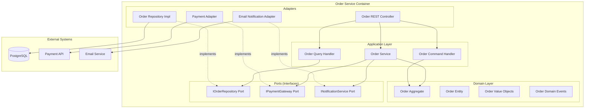
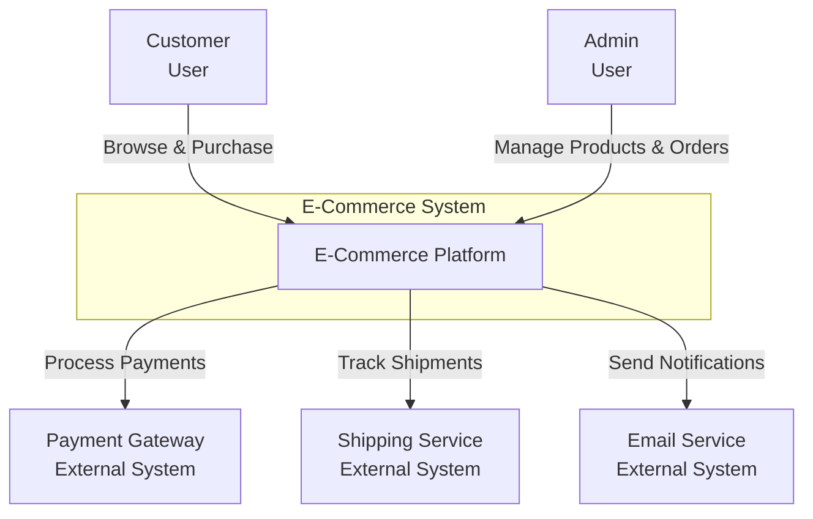
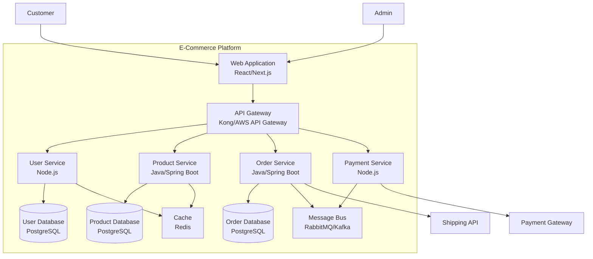
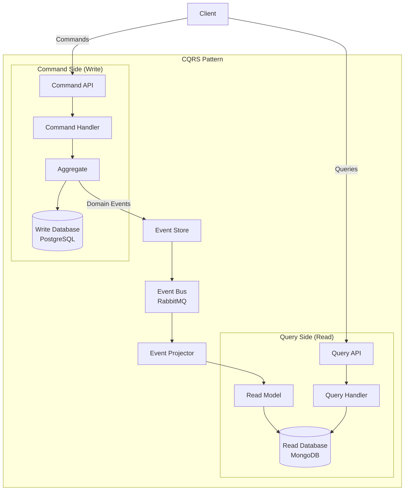

# Architecture Advisor Skill

시스템 아키텍처 설계 가이드, 디자인 패턴 추천, C4 다이어그램 생성, Architecture Decision Records (ADR) 작성을 지원합니다.

## Overview

Architecture Advisor는 확장 가능하고 유지보수 가능한 소프트웨어 아키텍처를 설계하고 문서화하는 전문 스킬입니다. 아키텍처 패턴 추천, DDD(Domain-Driven Design) 지원, 마이크로서비스 아키텍처 설계, C4 모델 다이어그램 생성, ADR 작성을 포함한 포괄적인 아키텍처 자문을 제공합니다.

## Core Capabilities

### 1. 아키텍처 패턴 추천
- 레이어드 아키텍처 (Layered Architecture)
- 헥사고날 아키텍처 (Hexagonal/Ports & Adapters)
- 클린 아키텍처 (Clean Architecture)
- 이벤트 주도 아키텍처 (Event-Driven Architecture)
- CQRS (Command Query Responsibility Segregation)
- 마이크로서비스 아키텍처

### 2. C4 다이어그램 생성
- Context 다이어그램: 시스템 컨텍스트
- Container 다이어그램: 컨테이너 구성
- Component 다이어그램: 컴포넌트 구조
- Code 다이어그램: 클래스 다이어그램 (선택적)

### 3. ADR (Architecture Decision Records)
- 아키텍처 결정 문서화
- 의사결정 컨텍스트 기록
- 대안 분석 및 결정 근거
- 결과 및 트레이드오프 문서화

### 4. 결합도/응집도 분석
- 모듈 간 의존성 분석
- 높은 응집도 설계 가이드
- 낮은 결합도 달성 전략
- 리팩토링 권장사항

### 5. DDD 패턴 적용
- Bounded Context 정의
- Aggregate 설계
- Entity vs Value Object 구분
- Repository 패턴
- Domain Event 설계

### 6. 마이크로서비스 패턴
- 서비스 분리 전략
- API Gateway 패턴
- Service Mesh
- Circuit Breaker
- Saga 패턴

## Workflow

### 1. 요구사항 분석
- 비즈니스 요구사항 이해
- 비기능 요구사항 파악 (성능, 확장성, 보안)
- 제약사항 식별
- 기존 시스템 분석

### 2. 아키텍처 설계
- 적합한 아키텍처 패턴 선택
- 시스템 분해 및 모듈화
- 컴포넌트 간 인터페이스 정의
- 데이터 흐름 설계

### 3. 다이어그램 생성
- C4 모델 적용
- 시스템 컨텍스트 다이어그램
- 컨테이너 다이어그램
- 컴포넌트 다이어그램
- 시퀀스 다이어그램 (필요 시)

### 4. 의사결정 문서화
- ADR 작성
- 대안 분석
- 트레이드오프 문서화
- 리스크 식별

### 5. 검증 및 리뷰
- 아키텍처 품질 속성 검증
- 성능, 확장성, 보안 검토
- 팀 리뷰 및 피드백
- 개선 방안 도출

## Checklist

### 아키텍처 설계
- [ ] 비즈니스 요구사항 명확히 이해
- [ ] 비기능 요구사항 정의
- [ ] 적합한 아키텍처 패턴 선택
- [ ] 시스템 경계 명확히 정의
- [ ] 모듈 간 의존성 최소화

### C4 다이어그램
- [ ] Context 다이어그램 작성
- [ ] Container 다이어그램 작성
- [ ] Component 다이어그램 작성
- [ ] 다이어그램 설명 추가
- [ ] 일관된 스타일 적용

### ADR
- [ ] 의사결정 배경 명확히 기술
- [ ] 고려한 대안 나열
- [ ] 선택한 솔루션 설명
- [ ] 트레이드오프 문서화
- [ ] 예상 결과 및 리스크 기록

### 품질 속성
- [ ] 성능 요구사항 검증
- [ ] 확장성 전략 수립
- [ ] 보안 고려사항 반영
- [ ] 가용성 설계
- [ ] 유지보수성 확보

### DDD 패턴
- [ ] Bounded Context 정의
- [ ] Aggregate 식별
- [ ] Entity/Value Object 구분
- [ ] Domain Event 정의
- [ ] Ubiquitous Language 수립

## Usage Examples

### Example 1: 헥사고날 아키텍처 설계

**요청:** "주문 관리 시스템을 헥사고날 아키텍처로 설계해주세요"

**생성된 C4 Component 다이어그램:**



**ADR 예제:**

```markdown
# ADR-001: 헥사고날 아키텍처 채택

## Status
Accepted

## Context
주문 관리 시스템을 개발하면서 다음과 같은 요구사항이 있습니다:
- 외부 시스템(결제, 배송, 알림)과의 통합이 빈번함
- 비즈니스 로직의 독립성 보장 필요
- 테스트 용이성 확보
- 향후 외부 시스템 교체 가능성

## Decision
헥사고날 아키텍처(Ports & Adapters)를 채택하기로 결정했습니다.

핵심 원칙:
1. Domain Layer: 순수한 비즈니스 로직, 외부 의존성 없음
2. Ports: 인터페이스를 통한 추상화
3. Adapters: 외부 시스템과의 실제 통합 구현

## Alternatives Considered

### 1. Layered Architecture
- 장점: 간단하고 이해하기 쉬움
- 단점: 레이어 간 의존성이 강해 테스트 어려움

### 2. Clean Architecture
- 장점: 의존성 역전, 테스트 용이
- 단점: 복잡도가 높음, 학습 곡선 큼

### 3. Hexagonal Architecture (선택)
- 장점: 비즈니스 로직 독립성, 외부 시스템 교체 용이
- 단점: 초기 설정 복잡도 증가

## Consequences

### Positive
- 비즈니스 로직과 인프라 분리로 테스트 용이
- 외부 시스템 교체 시 Adapter만 변경
- Mock 객체를 통한 단위 테스트 가능
- 비즈니스 로직의 재사용성 증가

### Negative
- 초기 개발 시간 증가
- 인터페이스와 구현체 분리로 코드량 증가
- 팀원 학습 필요

### Risks
- 과도한 추상화로 인한 복잡도 증가
- 잘못된 Port 설계 시 리팩토링 비용 증가
```

### Example 2: 마이크로서비스 아키텍처

**요청:** "이커머스 시스템을 마이크로서비스로 설계해주세요"

**C4 Context 다이어그램:**



**C4 Container 다이어그램:**



**ADR 예제:**

```markdown
# ADR-002: API Gateway 패턴 채택

## Status
Accepted

## Context
마이크로서비스 아키텍처에서 다음 문제를 해결해야 합니다:
- 클라이언트가 여러 서비스를 직접 호출해야 함
- 인증/인가를 각 서비스에서 중복 구현
- CORS, Rate Limiting 등 횡단 관심사 처리 필요
- 서비스 엔드포인트 변경 시 클라이언트 영향

## Decision
API Gateway 패턴을 도입하여 모든 클라이언트 요청의 단일 진입점으로 사용합니다.

## Alternatives Considered

### 1. Backend for Frontend (BFF)
- 장점: 각 클라이언트에 최적화된 API
- 단점: 여러 게이트웨이 관리 필요

### 2. Service Mesh
- 장점: 서비스 간 통신 최적화
- 단점: 복잡도 증가, 학습 곡선

### 3. API Gateway (선택)
- 장점: 단일 진입점, 횡단 관심사 중앙화
- 단점: 단일 장애점 가능성

## Consequences

### Positive
- 인증/인가 중앙화
- Rate Limiting, CORS 등 횡단 관심사 처리
- 서비스 라우팅 및 로드 밸런싱
- API 버저닝 관리 용이

### Negative
- 추가 네트워크 홉
- 잠재적 성능 병목
- 단일 장애점

### Mitigation
- API Gateway 이중화 (HA)
- Circuit Breaker 패턴 적용
- 캐싱 전략 수립
```

### Example 3: CQRS 패턴 적용

**Component 다이어그램:**



## Integration Points

### 다른 스킬과의 연계

- **api-designer**: API 설계 및 엔드포인트 정의
- **developer**: 아키텍처 기반 코드 생성
- **cicd-designer**: 배포 파이프라인 설계
- **tester**: 아키텍처 기반 테스트 전략
- **code-reviewer**: 아키텍처 원칙 준수 검증

### 외부 도구 통합

- **Structurizr**: C4 다이어그램 도구
- **PlantUML**: 다이어그램 생성
- **ArchUnit**: 아키텍처 규칙 검증
- **SonarQube**: 코드 품질 및 아키텍처 분석
- **ADR Tools**: ADR 관리 도구

## References

- `references/architecture-patterns.md` - 아키텍처 패턴 상세 설명
- `references/ddd-patterns.md` - DDD 패턴 및 전략
- `references/microservices-patterns.md` - 마이크로서비스 패턴
- `references/decision-records.md` - ADR 작성 가이드

## Best Practices

1. **단순성 유지**: 필요한 복잡도만 도입
2. **문서화**: 의사결정과 트레이드오프 기록
3. **진화적 설계**: 단계적으로 개선
4. **팀 합의**: 아키텍처 결정에 팀 참여
5. **품질 속성 우선**: 성능, 확장성, 보안 고려
6. **테스트 가능성**: 테스트하기 쉬운 구조
7. **의존성 관리**: 결합도 최소화
8. **명확한 경계**: 모듈/서비스 경계 명확히
