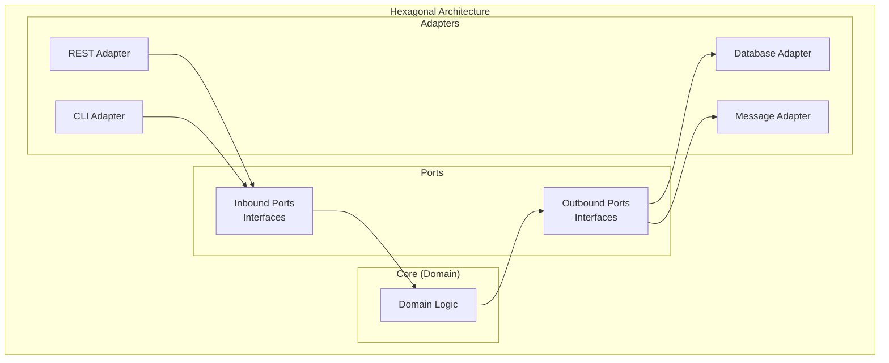
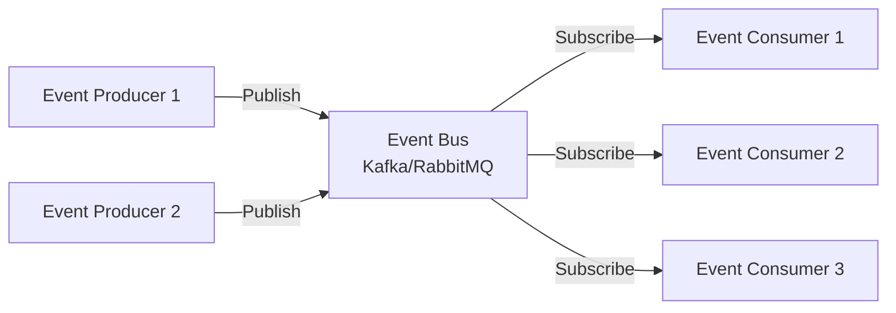
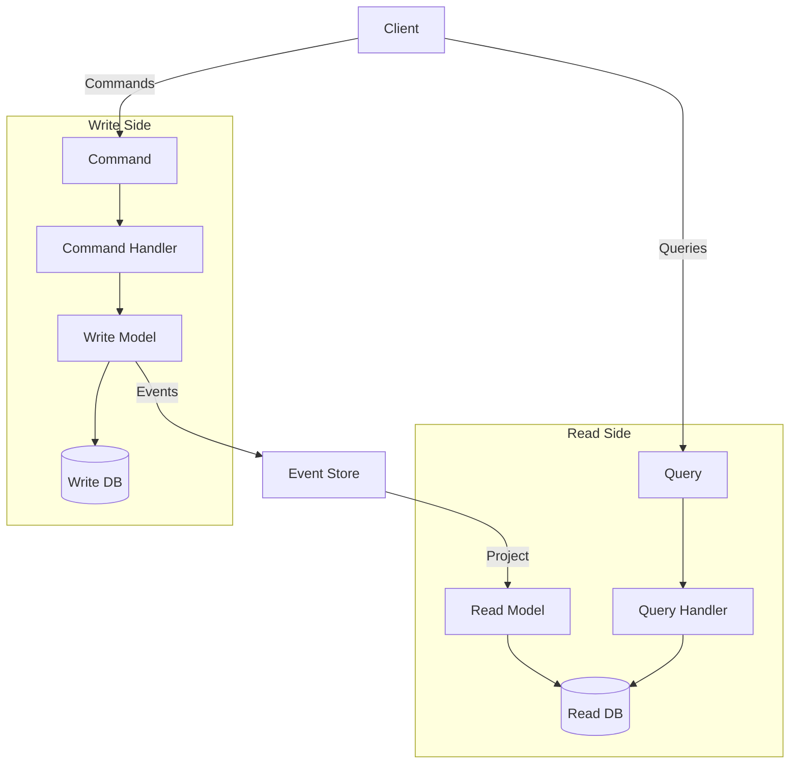

# 아키텍처 패턴

소프트웨어 아키텍처 설계에서 널리 사용되는 주요 패턴들을 설명합니다.

## 1. 레이어드 아키텍처 (Layered Architecture)

### 개요
애플리케이션을 수평적 레이어로 분리하는 가장 전통적인 아키텍처 패턴입니다.

### 구조

```
┌─────────────────────────┐
│   Presentation Layer    │  UI, Controllers, Views
├─────────────────────────┤
│    Business Layer       │  Business Logic, Services
├─────────────────────────┤
│   Persistence Layer     │  Data Access, Repositories
├─────────────────────────┤
│     Database Layer      │  Database
└─────────────────────────┘
```

### 예제 (Spring Boot)

```java
// Presentation Layer
@RestController
@RequestMapping("/api/users")
public class UserController {
    private final UserService userService;

    @GetMapping("/{id}")
    public ResponseEntity<UserDTO> getUser(@PathVariable Long id) {
        UserDTO user = userService.findById(id);
        return ResponseEntity.ok(user);
    }
}

// Business Layer
@Service
public class UserService {
    private final UserRepository userRepository;

    public UserDTO findById(Long id) {
        User user = userRepository.findById(id)
            .orElseThrow(() -> new UserNotFoundException(id));
        return UserMapper.toDTO(user);
    }
}

// Persistence Layer
@Repository
public interface UserRepository extends JpaRepository<User, Long> {
    Optional<User> findByEmail(String email);
}
```

### 장점
- 이해하기 쉬움
- 팀원 간 작업 분리 용이
- 표준화된 구조

### 단점
- 레이어 간 강한 결합
- 비즈니스 로직이 여러 레이어에 분산될 수 있음
- 테스트 어려움

### 적합한 경우
- 소규모 애플리케이션
- 단순한 CRUD 애플리케이션
- 빠른 개발이 필요한 경우

## 2. 헥사고날 아키텍처 (Hexagonal Architecture)

### 개요
비즈니스 로직을 중심에 두고 외부 시스템과의 통합을 Ports & Adapters로 분리합니다.

### 구조



### 예제 (Java)

```java
// Domain Layer
public class Order {
    private OrderId id;
    private CustomerId customerId;
    private List<OrderItem> items;
    private OrderStatus status;

    public void confirm() {
        if (items.isEmpty()) {
            throw new EmptyOrderException();
        }
        this.status = OrderStatus.CONFIRMED;
    }
}

// Inbound Port (Use Case Interface)
public interface CreateOrderUseCase {
    Order createOrder(CreateOrderCommand command);
}

// Outbound Port (Repository Interface)
public interface OrderRepository {
    Order save(Order order);
    Optional<Order> findById(OrderId id);
}

// Inbound Adapter (REST Controller)
@RestController
public class OrderController {
    private final CreateOrderUseCase createOrderUseCase;

    @PostMapping("/orders")
    public ResponseEntity<OrderResponse> createOrder(@RequestBody CreateOrderRequest request) {
        CreateOrderCommand command = new CreateOrderCommand(request.getCustomerId(), request.getItems());
        Order order = createOrderUseCase.createOrder(command);
        return ResponseEntity.ok(OrderResponse.from(order));
    }
}

// Outbound Adapter (JPA Repository)
@Repository
public class JpaOrderRepository implements OrderRepository {
    private final SpringDataOrderRepository springDataRepository;

    @Override
    public Order save(Order order) {
        OrderEntity entity = OrderMapper.toEntity(order);
        OrderEntity saved = springDataRepository.save(entity);
        return OrderMapper.toDomain(saved);
    }
}
```

### 장점
- 비즈니스 로직 독립성
- 외부 시스템 교체 용이
- 테스트 용이 (Mock 사용)
- 의존성 역전 원칙 준수

### 단점
- 초기 설정 복잡
- 코드량 증가
- 학습 곡선

### 적합한 경우
- 외부 시스템 통합이 많은 경우
- 비즈니스 로직이 복잡한 경우
- 테스트 가능성이 중요한 경우

## 3. 클린 아키텍처 (Clean Architecture)

### 개요
동심원 구조로 의존성이 외부에서 내부로만 향하도록 설계합니다.

### 구조

```
┌────────────────────────────────────────┐
│     Frameworks & Drivers (UI, DB)     │
├────────────────────────────────────────┤
│    Interface Adapters (Controllers)   │
├────────────────────────────────────────┤
│     Application Business Rules         │
│         (Use Cases)                    │
├────────────────────────────────────────┤
│     Enterprise Business Rules          │
│         (Entities)                     │
└────────────────────────────────────────┘
    ↓ Dependencies Direction ↓
```

### 예제 (TypeScript)

```typescript
// Entities (Enterprise Business Rules)
export class User {
  constructor(
    private id: UserId,
    private email: Email,
    private name: string
  ) {}

  changeEmail(newEmail: Email): void {
    // Business rule validation
    if (this.email.equals(newEmail)) {
      throw new Error('New email must be different');
    }
    this.email = newEmail;
  }
}

// Use Cases (Application Business Rules)
export interface CreateUserUseCase {
  execute(request: CreateUserRequest): Promise<CreateUserResponse>;
}

export class CreateUserInteractor implements CreateUserUseCase {
  constructor(
    private userRepository: UserRepository,
    private emailService: EmailService
  ) {}

  async execute(request: CreateUserRequest): Promise<CreateUserResponse> {
    const email = Email.create(request.email);
    const user = new User(UserId.generate(), email, request.name);

    await this.userRepository.save(user);
    await this.emailService.sendWelcomeEmail(email);

    return { userId: user.id.value };
  }
}

// Interface Adapters (Controllers)
export class UserController {
  constructor(private createUserUseCase: CreateUserUseCase) {}

  async createUser(req: Request, res: Response): Promise<void> {
    const request: CreateUserRequest = {
      email: req.body.email,
      name: req.body.name
    };

    const response = await this.createUserUseCase.execute(request);
    res.status(201).json(response);
  }
}

// Frameworks & Drivers (Database)
export class PostgresUserRepository implements UserRepository {
  async save(user: User): Promise<void> {
    await db.query('INSERT INTO users ...');
  }
}
```

### 장점
- 프레임워크 독립성
- 테스트 용이성
- UI 독립성
- 데이터베이스 독립성
- 비즈니스 규칙 집중

### 단점
- 복잡도 증가
- 초기 개발 시간 증가
- 과도한 추상화 가능성

### 적합한 경우
- 장기 유지보수가 필요한 경우
- 비즈니스 규칙이 복잡한 경우
- 프레임워크 변경 가능성이 있는 경우

## 4. 이벤트 주도 아키텍처 (Event-Driven Architecture)

### 개요
이벤트 생성, 감지, 소비를 통해 컴포넌트 간 통신하는 아키텍처입니다.

### 구조



### 예제 (Node.js)

```javascript
// Event Definition
class OrderCreatedEvent {
  constructor(orderId, customerId, totalAmount, timestamp) {
    this.eventType = 'OrderCreated';
    this.orderId = orderId;
    this.customerId = customerId;
    this.totalAmount = totalAmount;
    this.timestamp = timestamp;
  }
}

// Event Producer
class OrderService {
  constructor(eventBus, orderRepository) {
    this.eventBus = eventBus;
    this.orderRepository = orderRepository;
  }

  async createOrder(customerId, items) {
    const order = new Order(customerId, items);
    await this.orderRepository.save(order);

    // Publish event
    const event = new OrderCreatedEvent(
      order.id,
      customerId,
      order.totalAmount,
      new Date()
    );
    await this.eventBus.publish('orders', event);

    return order;
  }
}

// Event Consumer 1: Send email
class EmailNotificationService {
  constructor(eventBus, emailService) {
    this.emailService = emailService;

    eventBus.subscribe('orders', 'OrderCreated', async (event) => {
      await this.handleOrderCreated(event);
    });
  }

  async handleOrderCreated(event) {
    await this.emailService.send({
      to: event.customerId,
      subject: 'Order Confirmation',
      body: `Your order ${event.orderId} has been created`
    });
  }
}

// Event Consumer 2: Update inventory
class InventoryService {
  constructor(eventBus, inventoryRepository) {
    this.inventoryRepository = inventoryRepository;

    eventBus.subscribe('orders', 'OrderCreated', async (event) => {
      await this.handleOrderCreated(event);
    });
  }

  async handleOrderCreated(event) {
    await this.inventoryRepository.decreaseStock(event.items);
  }
}
```

### 장점
- 느슨한 결합
- 확장성
- 비동기 처리
- 이벤트 히스토리 유지

### 단점
- 복잡도 증가
- 디버깅 어려움
- 이벤트 순서 보장 어려움
- Eventually Consistent

### 적합한 경우
- 마이크로서비스 아키텍처
- 실시간 데이터 처리
- 확장성이 중요한 경우

## 5. CQRS (Command Query Responsibility Segregation)

### 개요
읽기(Query)와 쓰기(Command) 모델을 분리하는 패턴입니다.

### 구조



### 예제 (C#)

```csharp
// Command
public class CreateOrderCommand {
    public Guid CustomerId { get; set; }
    public List<OrderItem> Items { get; set; }
}

// Command Handler
public class CreateOrderCommandHandler {
    private readonly IOrderRepository _repository;
    private readonly IEventStore _eventStore;

    public async Task<Guid> Handle(CreateOrderCommand command) {
        var order = new Order(command.CustomerId, command.Items);
        await _repository.Save(order);

        var @event = new OrderCreatedEvent {
            OrderId = order.Id,
            CustomerId = command.CustomerId,
            TotalAmount = order.TotalAmount
        };
        await _eventStore.Save(@event);

        return order.Id;
    }
}

// Query
public class GetOrderQuery {
    public Guid OrderId { get; set; }
}

// Query Handler
public class GetOrderQueryHandler {
    private readonly IReadModelDatabase _readDb;

    public async Task<OrderDTO> Handle(GetOrderQuery query) {
        return await _readDb.Orders
            .Where(o => o.Id == query.OrderId)
            .FirstOrDefaultAsync();
    }
}

// Event Projector
public class OrderProjector {
    private readonly IReadModelDatabase _readDb;

    public async Task Project(OrderCreatedEvent @event) {
        var orderDTO = new OrderDTO {
            Id = @event.OrderId,
            CustomerId = @event.CustomerId,
            TotalAmount = @event.TotalAmount,
            Status = "Created"
        };
        await _readDb.Orders.Add(orderDTO);
    }
}
```

### 장점
- 읽기/쓰기 성능 최적화
- 복잡한 쿼리 단순화
- 독립적 확장
- 이벤트 소싱과 결합 가능

### 단점
- 복잡도 증가
- Eventually Consistent
- 코드 중복 가능성
- 동기화 이슈

### 적합한 경우
- 읽기와 쓰기 비율 차이가 큰 경우
- 복잡한 비즈니스 로직
- 높은 성능 요구사항

## 6. 마이크로커널 아키텍처 (Microkernel Architecture)

### 개요
핵심 시스템과 플러그인 모듈로 구성되는 아키텍처입니다.

### 구조

```
┌─────────────────────────────────┐
│         Core System             │
│    (Minimal functionality)      │
└────────────┬────────────────────┘
             │
    ┌────────┼────────┐
    │        │        │
┌───▼───┐ ┌──▼──┐ ┌──▼───┐
│Plugin1│ │Plugin2│ │Plugin3│
└───────┘ └──────┘ └──────┘
```

### 예제 (Python)

```python
# Core System
class PluginManager:
    def __init__(self):
        self._plugins = {}

    def register(self, name: str, plugin: Plugin):
        self._plugins[name] = plugin

    def execute(self, plugin_name: str, data: dict):
        plugin = self._plugins.get(plugin_name)
        if plugin is None:
            raise PluginNotFoundError(plugin_name)
        return plugin.execute(data)

# Plugin Interface
class Plugin(ABC):
    @abstractmethod
    def execute(self, data: dict) -> dict:
        pass

# Plugin Implementation
class PDFExportPlugin(Plugin):
    def execute(self, data: dict) -> dict:
        pdf_content = self.generate_pdf(data)
        return {"format": "pdf", "content": pdf_content}

class ExcelExportPlugin(Plugin):
    def execute(self, data: dict) -> dict:
        excel_content = self.generate_excel(data)
        return {"format": "excel", "content": excel_content}

# Usage
plugin_manager = PluginManager()
plugin_manager.register("pdf", PDFExportPlugin())
plugin_manager.register("excel", ExcelExportPlugin())

result = plugin_manager.execute("pdf", report_data)
```

### 장점
- 확장 용이
- 유연성
- 모듈 독립성
- 점진적 개발

### 단점
- 플러그인 관리 복잡
- 성능 오버헤드
- 버전 호환성 이슈

### 적합한 경우
- IDE, 브라우저 같은 확장 가능한 시스템
- 다양한 기능 추가가 필요한 경우

## 패턴 선택 가이드

| 요구사항 | 추천 패턴 |
|---------|---------|
| 단순한 CRUD | Layered |
| 복잡한 비즈니스 로직 | Hexagonal, Clean |
| 외부 시스템 통합 많음 | Hexagonal |
| 높은 확장성 | Microservices, Event-Driven |
| 읽기/쓰기 분리 필요 | CQRS |
| 플러그인 시스템 | Microkernel |

## 체크리스트

- [ ] 비즈니스 요구사항 분석
- [ ] 비기능 요구사항 파악
- [ ] 팀 역량 고려
- [ ] 확장성 요구사항 검토
- [ ] 유지보수성 고려
- [ ] 테스트 전략 수립
- [ ] 성능 요구사항 확인
- [ ] 배포 전략 고려
