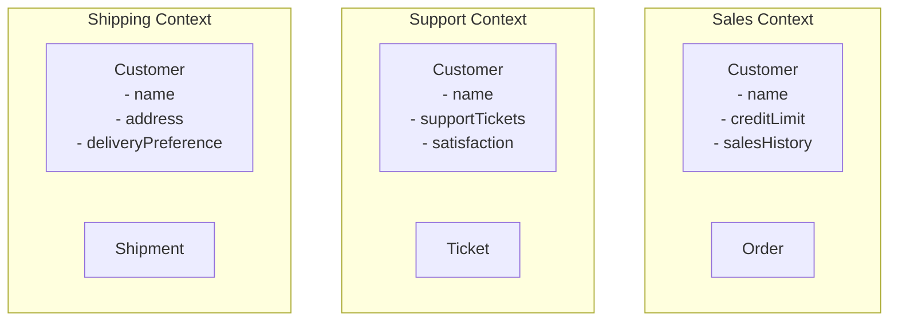
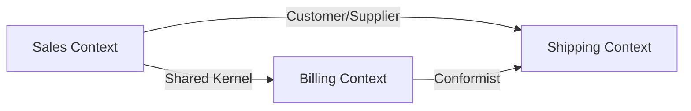

# Domain-Driven Design (DDD) 패턴

DDD는 복잡한 비즈니스 도메인을 소프트웨어로 모델링하기 위한 접근 방식입니다.

## 핵심 개념

### 1. Ubiquitous Language (공통 언어)

팀 전체가 사용하는 공통 용어를 정의하여 커뮤니케이션 향상

```
// 나쁜 예: 기술적 용어
class DataRecord {
    String field1;
    String field2;
}

// 좋은 예: 도메인 언어
class Order {
    OrderId orderId;
    CustomerId customerId;
    OrderStatus status;
}
```

### 2. Bounded Context (경계 컨텍스트)

도메인 모델이 적용되는 명확한 경계를 정의



## Building Blocks

### 1. Entity (엔티티)

고유 식별자를 가지며 시간에 따라 변경되는 객체

```java
public class Order {
    private final OrderId id;  // 식별자
    private CustomerId customerId;
    private List<OrderLine> orderLines;
    private OrderStatus status;
    private LocalDateTime createdAt;

    // 비즈니스 메서드
    public void addOrderLine(Product product, int quantity) {
        if (status != OrderStatus.DRAFT) {
            throw new IllegalStateException("Cannot modify confirmed order");
        }
        orderLines.add(new OrderLine(product, quantity));
    }

    public void confirm() {
        if (orderLines.isEmpty()) {
            throw new IllegalStateException("Cannot confirm empty order");
        }
        this.status = OrderStatus.CONFIRMED;
    }

    @Override
    public boolean equals(Object o) {
        if (this == o) return true;
        if (!(o instanceof Order)) return false;
        Order order = (Order) o;
        return Objects.equals(id, order.id);  // ID로만 비교
    }
}
```

### 2. Value Object (값 객체)

식별자가 없으며 값으로 비교되는 불변 객체

```java
public class Money {
    private final BigDecimal amount;
    private final Currency currency;

    public Money(BigDecimal amount, Currency currency) {
        if (amount == null || currency == null) {
            throw new IllegalArgumentException("Amount and currency are required");
        }
        this.amount = amount;
        this.currency = currency;
    }

    public Money add(Money other) {
        if (!this.currency.equals(other.currency)) {
            throw new IllegalArgumentException("Cannot add different currencies");
        }
        return new Money(this.amount.add(other.amount), this.currency);
    }

    @Override
    public boolean equals(Object o) {
        if (this == o) return true;
        if (!(o instanceof Money)) return false;
        Money money = (Money) o;
        return amount.equals(money.amount) && currency.equals(money.currency);
    }

    // Immutable - no setters
}
```

```typescript
// TypeScript Value Object
class Email {
  private readonly value: string;

  private constructor(value: string) {
    this.value = value;
  }

  static create(email: string): Email {
    if (!this.isValid(email)) {
      throw new Error('Invalid email format');
    }
    return new Email(email.toLowerCase());
  }

  private static isValid(email: string): boolean {
    return /^[^\s@]+@[^\s@]+\.[^\s@]+$/.test(email);
  }

  equals(other: Email): boolean {
    return this.value === other.value;
  }

  toString(): string {
    return this.value;
  }
}
```

### 3. Aggregate (집합체)

관련된 Entity와 Value Object를 하나의 단위로 묶음

```java
public class Order {  // Aggregate Root
    private final OrderId id;
    private final CustomerId customerId;
    private final List<OrderLine> orderLines;  // Part of aggregate
    private Money totalAmount;
    private OrderStatus status;

    // Aggregate 내부 일관성 보장
    public void addOrderLine(Product product, int quantity, Money unitPrice) {
        if (status != OrderStatus.DRAFT) {
            throw new IllegalStateException("Cannot modify confirmed order");
        }

        OrderLine orderLine = new OrderLine(
            OrderLineId.generate(),
            product.getId(),
            quantity,
            unitPrice
        );

        this.orderLines.add(orderLine);
        this.recalculateTotal();  // 내부 일관성 유지
    }

    private void recalculateTotal() {
        this.totalAmount = orderLines.stream()
            .map(OrderLine::getLineTotal)
            .reduce(Money.ZERO, Money::add);
    }

    // Aggregate 외부에서는 Root를 통해서만 접근
    public List<OrderLine> getOrderLines() {
        return Collections.unmodifiableList(orderLines);
    }
}
```

**Aggregate 설계 규칙:**
1. Aggregate Root만 외부에서 참조 가능
2. Aggregate 내부는 트랜잭션 일관성 보장
3. Aggregate 간 참조는 ID만 사용
4. 작게 유지 (성능 고려)

### 4. Domain Event (도메인 이벤트)

도메인에서 발생한 중요한 사건을 나타냄

```java
public class OrderConfirmedEvent {
    private final OrderId orderId;
    private final CustomerId customerId;
    private final Money totalAmount;
    private final LocalDateTime occurredAt;

    public OrderConfirmedEvent(OrderId orderId, CustomerId customerId, Money totalAmount) {
        this.orderId = orderId;
        this.customerId = customerId;
        this.totalAmount = totalAmount;
        this.occurredAt = LocalDateTime.now();
    }

    // Getters only - immutable
}

// Aggregate에서 이벤트 발생
public class Order {
    private List<DomainEvent> domainEvents = new ArrayList<>();

    public void confirm() {
        if (orderLines.isEmpty()) {
            throw new IllegalStateException("Cannot confirm empty order");
        }

        this.status = OrderStatus.CONFIRMED;

        // 도메인 이벤트 발생
        this.domainEvents.add(new OrderConfirmedEvent(
            this.id,
            this.customerId,
            this.totalAmount
        ));
    }

    public List<DomainEvent> getDomainEvents() {
        return List.copyOf(domainEvents);
    }

    public void clearDomainEvents() {
        this.domainEvents.clear();
    }
}
```

### 5. Repository (리포지토리)

Aggregate의 영속성을 추상화

```java
// Repository Interface (Domain Layer)
public interface OrderRepository {
    Order findById(OrderId id);
    void save(Order order);
    List<Order> findByCustomerId(CustomerId customerId);
    void delete(OrderId id);
}

// Repository Implementation (Infrastructure Layer)
@Repository
public class JpaOrderRepository implements OrderRepository {
    private final SpringDataOrderRepository springDataRepository;

    @Override
    public Order findById(OrderId id) {
        return springDataRepository.findById(id.getValue())
            .map(OrderMapper::toDomain)
            .orElseThrow(() -> new OrderNotFoundException(id));
    }

    @Override
    public void save(Order order) {
        OrderEntity entity = OrderMapper.toEntity(order);
        springDataRepository.save(entity);

        // 도메인 이벤트 발행
        publishDomainEvents(order.getDomainEvents());
        order.clearDomainEvents();
    }
}
```

### 6. Domain Service (도메인 서비스)

여러 Aggregate에 걸친 비즈니스 로직

```java
@Service
public class TransferMoneyService {
    public void transfer(Account fromAccount, Account toAccount, Money amount) {
        // 두 Aggregate에 걸친 로직
        fromAccount.withdraw(amount);
        toAccount.deposit(amount);

        // 이벤트 발행
        DomainEventPublisher.publish(new MoneyTransferredEvent(
            fromAccount.getId(),
            toAccount.getId(),
            amount
        ));
    }
}
```

### 7. Application Service (애플리케이션 서비스)

Use Case 조율 및 트랜잭션 관리

```java
@Service
@Transactional
public class OrderApplicationService {
    private final OrderRepository orderRepository;
    private final ProductRepository productRepository;
    private final CustomerRepository customerRepository;

    public OrderId createOrder(CreateOrderCommand command) {
        // 1. Aggregate 조회
        Customer customer = customerRepository.findById(command.getCustomerId());
        List<Product> products = productRepository.findByIds(command.getProductIds());

        // 2. 비즈니스 규칙 검증
        if (!customer.canPlaceOrder()) {
            throw new CustomerNotEligibleException();
        }

        // 3. Aggregate 생성
        Order order = new Order(
            OrderId.generate(),
            customer.getId(),
            command.getOrderLines()
        );

        // 4. 저장
        orderRepository.save(order);

        return order.getId();
    }
}
```

## Layered Architecture with DDD

```
┌─────────────────────────────────┐
│     Presentation Layer          │  Controllers, DTOs
├─────────────────────────────────┤
│     Application Layer           │  Application Services, Use Cases
├─────────────────────────────────┤
│     Domain Layer                │  Entities, Value Objects,
│                                 │  Aggregates, Domain Services,
│                                 │  Repository Interfaces
├─────────────────────────────────┤
│     Infrastructure Layer        │  Repository Implementations,
│                                 │  External Services, Database
└─────────────────────────────────┘
```

## Context Mapping

여러 Bounded Context 간의 관계를 정의



**관계 유형:**
- **Shared Kernel**: 공통 도메인 모델 공유
- **Customer/Supplier**: 고객-공급자 관계
- **Conformist**: 한쪽이 다른 쪽 모델을 따름
- **Anti-Corruption Layer**: 외부 모델로부터 보호 계층

## 전략적 설계 (Strategic Design)

### Bounded Context 식별

```
E-Commerce 시스템 예제:

1. 상품 카탈로그 (Product Catalog Context)
   - Product, Category, Pricing

2. 주문 관리 (Order Management Context)
   - Order, OrderLine, Customer

3. 배송 (Shipping Context)
   - Shipment, DeliveryAddress, Carrier

4. 결제 (Payment Context)
   - Payment, Invoice, Transaction
```

## 전술적 설계 (Tactical Design)

### Aggregate 설계 패턴

```java
// 좋은 Aggregate 설계
public class Order {
    private OrderId id;
    private CustomerId customerId;  // 참조는 ID만
    private List<OrderLine> lines;  // Aggregate 내부
    private Money total;

    public void addLine(ProductId productId, int quantity, Money price) {
        // 비즈니스 규칙
        // 내부 일관성 유지
    }
}

// 나쁜 Aggregate 설계
public class Order {
    private OrderId id;
    private Customer customer;  // 전체 객체 참조 X
    private List<OrderLine> lines;
    private Shipping shipping;  // 다른 Aggregate 포함 X
}
```

## 체크리스트

- [ ] Ubiquitous Language 정의
- [ ] Bounded Context 식별
- [ ] Entity vs Value Object 구분
- [ ] Aggregate 경계 설정
- [ ] Aggregate Root 정의
- [ ] Repository 인터페이스 설계
- [ ] Domain Event 식별
- [ ] Application Service 설계
- [ ] 불변성 보장
- [ ] 비즈니스 규칙 캡슐화
