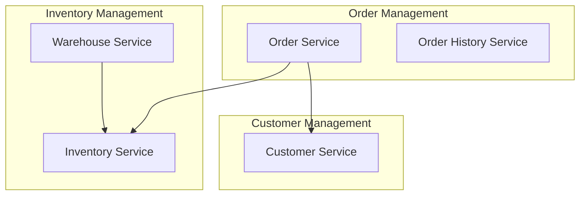

# 마이크로서비스 패턴

마이크로서비스 아키텍처 구축 시 필요한 주요 패턴들을 설명합니다.

## 서비스 분해 패턴

### 1. Decompose by Business Capability

비즈니스 기능별로 서비스 분리

```
E-Commerce 예제:
- User Service: 사용자 관리
- Product Catalog Service: 상품 카탈로그
- Order Service: 주문 처리
- Payment Service: 결제 처리
- Shipping Service: 배송 관리
- Notification Service: 알림 발송
```

### 2. Decompose by Subdomain (DDD)

DDD의 Bounded Context 기반 분리



## 통신 패턴

### 1. API Gateway

단일 진입점을 통한 라우팅 및 인증

```javascript
// API Gateway (Express.js)
const express = require('express');
const httpProxy = require('http-proxy-middleware');

const app = express();

// 인증 미들웨어
app.use(async (req, res, next) => {
  const token = req.headers.authorization;
  if (!token) {
    return res.status(401).json({ error: 'Unauthorized' });
  }
  // JWT 검증
  next();
});

// 라우팅
app.use('/api/users', httpProxy({ target: 'http://user-service:3001' }));
app.use('/api/products', httpProxy({ target: 'http://product-service:3002' }));
app.use('/api/orders', httpProxy({ target: 'http://order-service:3003' }));

// Rate Limiting
app.use(rateLimit({
  windowMs: 15 * 60 * 1000,
  max: 100
}));

app.listen(3000);
```

### 2. Backend for Frontend (BFF)

클라이언트별 맞춤 API

```
┌─────────────┐     ┌─────────────┐
│  Web App    │────▶│   Web BFF   │
└─────────────┘     └─────────────┘
                           │
┌─────────────┐            │         ┌──────────────┐
│ Mobile App  │────▶│ Mobile BFF  │─────▶│  Services    │
└─────────────┘     └─────────────┘     └──────────────┘
```

### 3. Service Mesh

서비스 간 통신 관리 (Istio, Linkerd)

```yaml
# Istio VirtualService
apiVersion: networking.istio.io/v1alpha3
kind: VirtualService
metadata:
  name: order-service
spec:
  hosts:
  - order-service
  http:
  - match:
    - headers:
        version:
          exact: v2
    route:
    - destination:
        host: order-service
        subset: v2
  - route:
    - destination:
        host: order-service
        subset: v1
```

## 데이터 관리 패턴

### 1. Database per Service

각 서비스가 독립적인 데이터베이스 소유

```
┌──────────────┐     ┌──────────────┐
│ User Service │     │Order Service │
└──────┬───────┘     └──────┬───────┘
       │                    │
   ┌───▼────┐          ┌────▼───┐
   │User DB │          │Order DB│
   └────────┘          └────────┘
```

### 2. Saga Pattern

분산 트랜잭션 관리

**Choreography 방식 (이벤트 기반):**

```javascript
// Order Service
async function createOrder(orderData) {
  const order = await orderRepository.save(orderData);

  // 이벤트 발행
  await eventBus.publish('OrderCreated', {
    orderId: order.id,
    customerId: order.customerId,
    totalAmount: order.totalAmount
  });

  return order;
}

// Payment Service (구독)
eventBus.subscribe('OrderCreated', async (event) => {
  try {
    const payment = await processPayment(event);
    await eventBus.publish('PaymentCompleted', {
      orderId: event.orderId,
      paymentId: payment.id
    });
  } catch (error) {
    await eventBus.publish('PaymentFailed', {
      orderId: event.orderId,
      reason: error.message
    });
  }
});

// Order Service (보상 트랜잭션)
eventBus.subscribe('PaymentFailed', async (event) => {
  await orderRepository.updateStatus(event.orderId, 'CANCELLED');
});
```

**Orchestration 방식 (중앙 조정):**

```java
@Service
public class OrderSaga {
    private final OrderService orderService;
    private final PaymentService paymentService;
    private final InventoryService inventoryService;

    public void executeOrderSaga(CreateOrderCommand command) {
        Order order = null;
        Payment payment = null;

        try {
            // 1. 주문 생성
            order = orderService.createOrder(command);

            // 2. 재고 확인 및 예약
            inventoryService.reserveStock(order.getItems());

            // 3. 결제 처리
            payment = paymentService.processPayment(order.getTotalAmount());

            // 4. 주문 확정
            orderService.confirmOrder(order.getId());

        } catch (Exception e) {
            // 보상 트랜잭션
            if (payment != null) {
                paymentService.refund(payment.getId());
            }
            if (order != null) {
                inventoryService.releaseStock(order.getItems());
                orderService.cancelOrder(order.getId());
            }
            throw new SagaExecutionException(e);
        }
    }
}
```

### 3. CQRS

읽기/쓰기 모델 분리

```typescript
// Command Side
class CreateOrderCommandHandler {
  async handle(command: CreateOrderCommand): Promise<void> {
    const order = new Order(command.customerId, command.items);
    await this.orderRepository.save(order);

    // 이벤트 발행
    await this.eventBus.publish(new OrderCreatedEvent(order.id, order.customerId));
  }
}

// Query Side
class OrderQueryService {
  async getOrdersByCustomer(customerId: string): Promise<OrderDTO[]> {
    // 읽기 최적화된 모델에서 조회
    return await this.readDatabase.query(
      'SELECT * FROM order_view WHERE customer_id = $1',
      [customerId]
    );
  }
}

// Event Projector (읽기 모델 업데이트)
class OrderProjector {
  async onOrderCreated(event: OrderCreatedEvent): Promise<void> {
    await this.readDatabase.execute(`
      INSERT INTO order_view (id, customer_id, status, created_at)
      VALUES ($1, $2, 'CREATED', NOW())
    `, [event.orderId, event.customerId]);
  }
}
```

## 복원력 패턴 (Resiliency Patterns)

### 1. Circuit Breaker

장애 전파 방지

```javascript
const CircuitBreaker = require('opossum');

// Circuit Breaker 설정
const options = {
  timeout: 3000,        // 3초 타임아웃
  errorThresholdPercentage: 50,
  resetTimeout: 30000   // 30초 후 재시도
};

async function callPaymentService(amount) {
  const response = await fetch('http://payment-service/charge', {
    method: 'POST',
    body: JSON.stringify({ amount })
  });
  return response.json();
}

const breaker = new CircuitBreaker(callPaymentService, options);

// Fallback 처리
breaker.fallback(() => {
  return { status: 'pending', message: 'Payment service unavailable' };
});

// 사용
breaker.fire(100.00)
  .then(result => console.log(result))
  .catch(err => console.error(err));
```

### 2. Retry Pattern

일시적 장애 재시도

```python
from tenacity import retry, stop_after_attempt, wait_exponential

@retry(
    stop=stop_after_attempt(3),
    wait=wait_exponential(multiplier=1, min=2, max=10)
)
async def call_external_service(data):
    response = await http_client.post('http://external-service/api', json=data)
    if response.status_code >= 500:
        raise ServiceUnavailableError()
    return response.json()
```

### 3. Bulkhead Pattern

리소스 격리

```java
@Service
public class OrderService {
    // 주문 처리용 스레드 풀
    private final ExecutorService orderExecutor = Executors.newFixedThreadPool(10);

    // 조회용 스레드 풀
    private final ExecutorService queryExecutor = Executors.newFixedThreadPool(20);

    public CompletableFuture<Order> createOrder(CreateOrderRequest request) {
        return CompletableFuture.supplyAsync(() -> {
            // 주문 처리 로직
            return processOrder(request);
        }, orderExecutor);
    }

    public CompletableFuture<List<Order>> getOrders(String customerId) {
        return CompletableFuture.supplyAsync(() -> {
            // 조회 로직
            return queryOrders(customerId);
        }, queryExecutor);
    }
}
```

## 관찰성 패턴 (Observability Patterns)

### 1. Health Check API

서비스 상태 모니터링

```javascript
app.get('/health', async (req, res) => {
  const health = {
    status: 'UP',
    timestamp: new Date().toISOString(),
    checks: {
      database: await checkDatabase(),
      redis: await checkRedis(),
      externalAPI: await checkExternalAPI()
    }
  };

  const isHealthy = Object.values(health.checks).every(check => check.status === 'UP');

  res.status(isHealthy ? 200 : 503).json(health);
});

async function checkDatabase() {
  try {
    await db.query('SELECT 1');
    return { status: 'UP' };
  } catch (error) {
    return { status: 'DOWN', error: error.message };
  }
}
```

### 2. Distributed Tracing

요청 추적 (OpenTelemetry, Jaeger)

```javascript
const { trace } = require('@opentelemetry/api');
const tracer = trace.getTracer('order-service');

app.post('/orders', async (req, res) => {
  const span = tracer.startSpan('create-order');

  try {
    span.setAttribute('customer_id', req.body.customerId);

    // 주문 생성
    const order = await createOrder(req.body);
    span.addEvent('order-created', { order_id: order.id });

    // 재고 확인 (하위 span)
    const inventorySpan = tracer.startSpan('check-inventory', {
      parent: span
    });
    await checkInventory(order.items);
    inventorySpan.end();

    span.setStatus({ code: 1 });  // OK
    res.json(order);
  } catch (error) {
    span.setStatus({ code: 2, message: error.message });  // ERROR
    span.recordException(error);
    res.status(500).json({ error: error.message });
  } finally {
    span.end();
  }
});
```

### 3. Centralized Logging

중앙 로깅 (ELK, Loki)

```javascript
const winston = require('winston');

const logger = winston.createLogger({
  format: winston.format.combine(
    winston.format.timestamp(),
    winston.format.json()
  ),
  defaultMeta: {
    service: 'order-service',
    version: '1.0.0'
  },
  transports: [
    new winston.transports.Console(),
    new winston.transports.File({ filename: 'logs/app.log' })
  ]
});

// 구조화된 로깅
logger.info('Order created', {
  orderId: order.id,
  customerId: order.customerId,
  totalAmount: order.totalAmount,
  traceId: req.headers['x-trace-id']
});
```

## 배포 패턴

### 1. Blue-Green Deployment

```yaml
# Blue (현재 프로덕션)
apiVersion: v1
kind: Service
metadata:
  name: order-service
spec:
  selector:
    app: order-service
    version: blue  # blue 버전으로 트래픽
  ports:
  - port: 80
    targetPort: 3000

---
# Green 배포 후 selector를 green으로 변경
```

### 2. Canary Deployment

```yaml
# Istio를 사용한 Canary 배포
apiVersion: networking.istio.io/v1alpha3
kind: VirtualService
metadata:
  name: order-service
spec:
  hosts:
  - order-service
  http:
  - match:
    - headers:
        user-group:
          exact: canary
    route:
    - destination:
        host: order-service
        subset: v2
      weight: 100
  - route:
    - destination:
        host: order-service
        subset: v1
      weight: 90
    - destination:
        host: order-service
        subset: v2
      weight: 10  # 10% 트래픽만 새 버전으로
```

## 보안 패턴

### 1. Access Token

```javascript
// JWT 발급
const jwt = require('jsonwebtoken');

function generateToken(user) {
  return jwt.sign(
    {
      userId: user.id,
      email: user.email,
      roles: user.roles
    },
    process.env.JWT_SECRET,
    { expiresIn: '1h' }
  );
}

// JWT 검증 미들웨어
function authenticateToken(req, res, next) {
  const token = req.headers['authorization']?.split(' ')[1];

  if (!token) {
    return res.status(401).json({ error: 'Access token required' });
  }

  jwt.verify(token, process.env.JWT_SECRET, (err, user) => {
    if (err) {
      return res.status(403).json({ error: 'Invalid token' });
    }
    req.user = user;
    next();
  });
}
```

### 2. API Rate Limiting

```javascript
const rateLimit = require('express-rate-limit');
const RedisStore = require('rate-limit-redis');

const limiter = rateLimit({
  store: new RedisStore({
    client: redisClient
  }),
  windowMs: 15 * 60 * 1000,  // 15분
  max: 100,  // 최대 100 요청
  message: 'Too many requests, please try again later'
});

app.use('/api/', limiter);
```

## 체크리스트

- [ ] 서비스 경계 명확히 정의
- [ ] Database per Service 패턴 적용
- [ ] API Gateway 또는 Service Mesh 선택
- [ ] Saga 패턴으로 분산 트랜잭션 관리
- [ ] Circuit Breaker 구현
- [ ] Health Check API 제공
- [ ] Distributed Tracing 설정
- [ ] Centralized Logging 구축
- [ ] 서비스 간 통신 보안 (mTLS)
- [ ] 배포 전략 수립 (Blue-Green/Canary)
