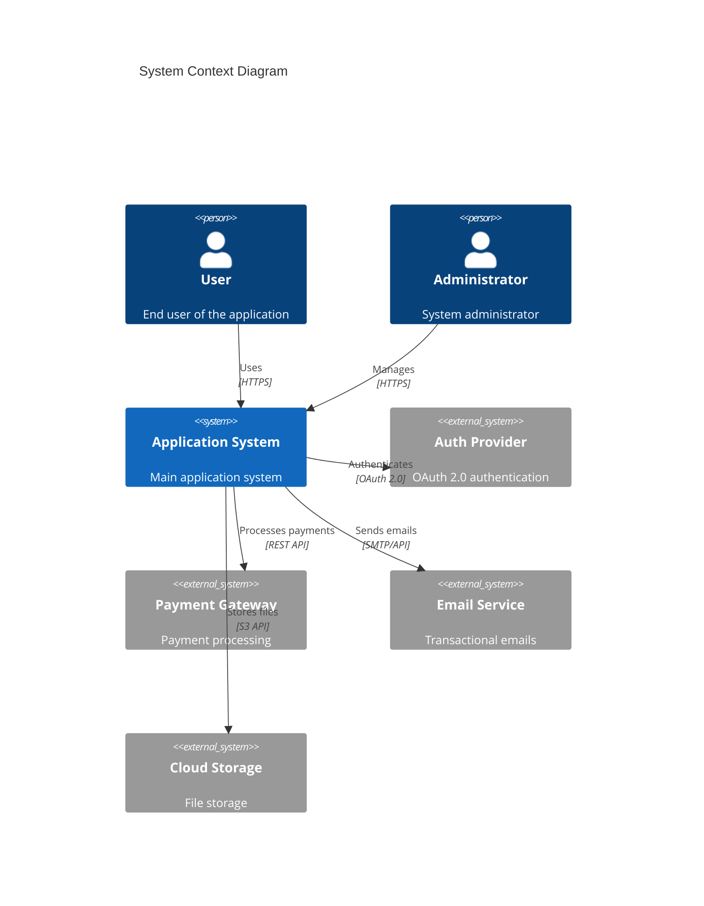
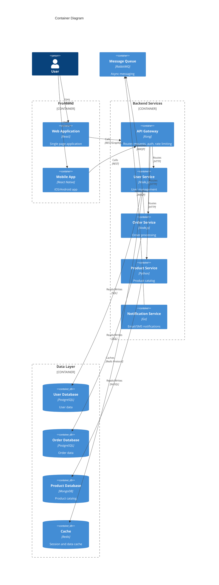
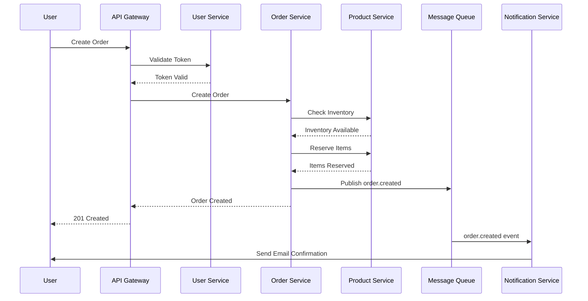
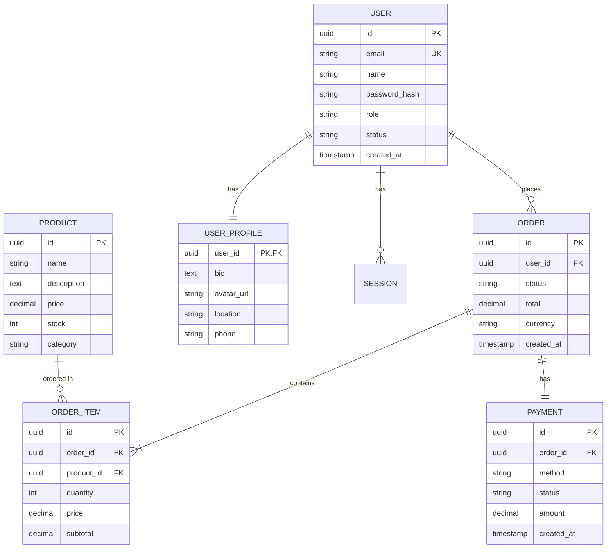
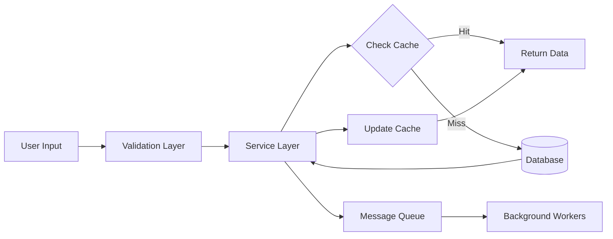
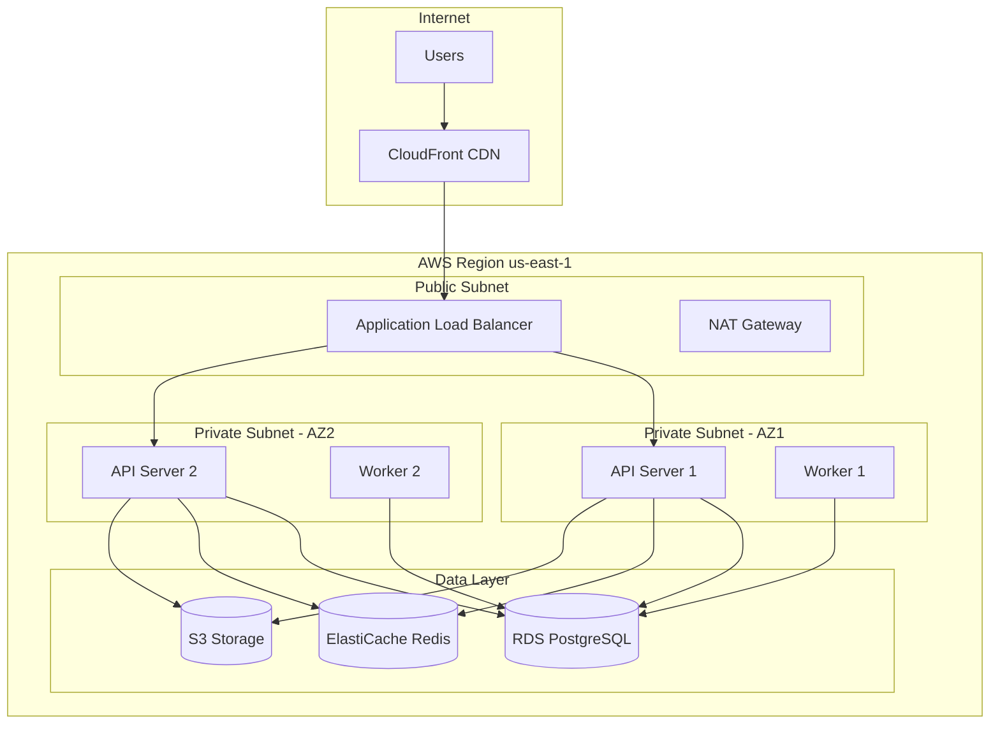
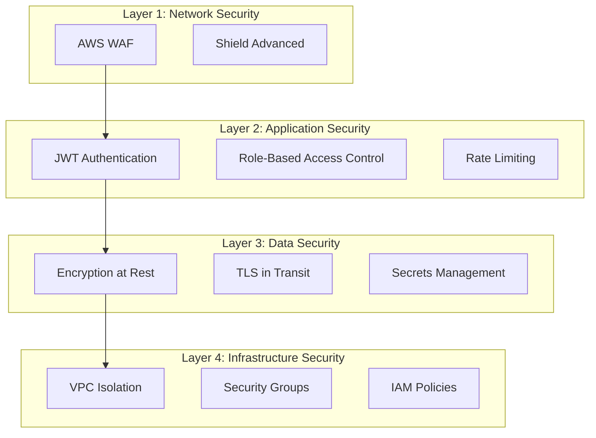
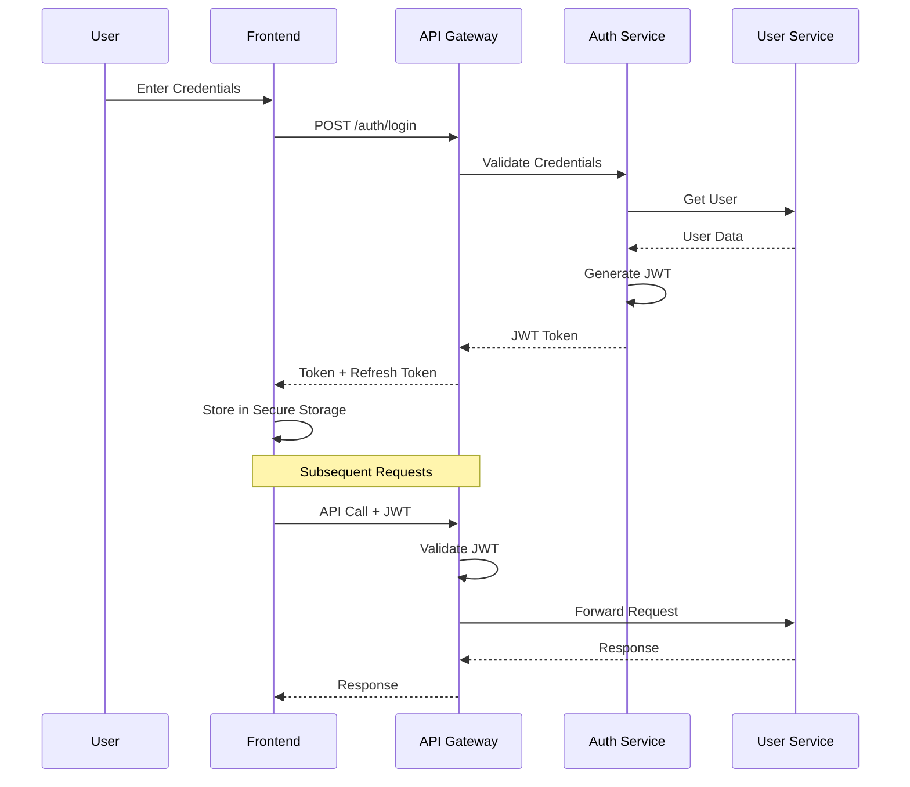
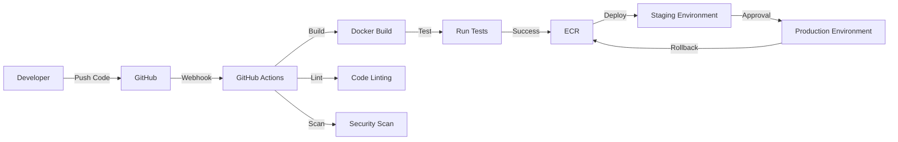
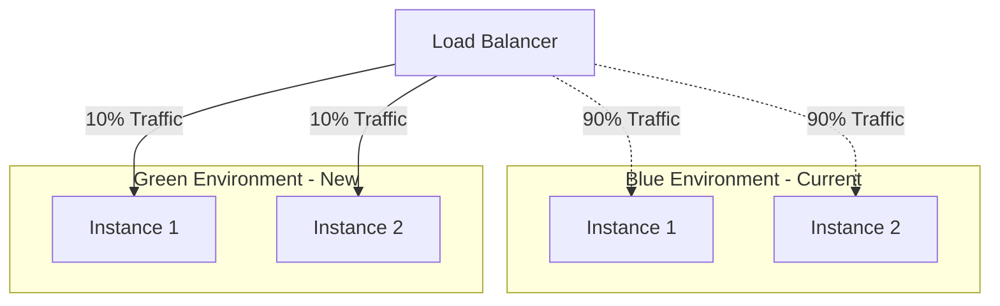

# System Architecture Documentation

**Project:** [Project Name]
**Version:** 1.0.0
**Last Updated:** 2025-01-20
**Authors:** [Team Name]

## Table of Contents

- [Executive Summary](#executive-summary)
- [System Overview](#system-overview)
- [Architecture Goals](#architecture-goals)
- [High-Level Architecture](#high-level-architecture)
- [Component Architecture](#component-architecture)
- [Data Architecture](#data-architecture)
- [Infrastructure Architecture](#infrastructure-architecture)
- [Security Architecture](#security-architecture)
- [Deployment Architecture](#deployment-architecture)
- [Technology Stack](#technology-stack)
- [Design Decisions](#design-decisions)
- [Trade-offs and Constraints](#trade-offs-and-constraints)
- [Future Considerations](#future-considerations)

## Executive Summary

Provide a brief, high-level overview of the system architecture. This section should be understandable by non-technical stakeholders.

**Key Points:**
- Purpose of the system
- Main architectural style (e.g., microservices, monolithic, serverless)
- Key technologies used
- Scale and performance characteristics

## System Overview

### Purpose

Describe what the system does and what problems it solves.

### Key Features

- Feature 1: Description
- Feature 2: Description
- Feature 3: Description

### Scope

What is included and excluded from this system.

**In Scope:**
- User authentication and authorization
- Data processing and storage
- API for external integrations

**Out of Scope:**
- Mobile application (separate project)
- Legacy system migration

## Architecture Goals

### Functional Requirements

- Support 10,000 concurrent users
- Process 1 million transactions per day
- Sub-second response time for API calls
- 99.9% uptime SLA

### Non-Functional Requirements

- **Scalability:** Horizontal scaling to handle increased load
- **Availability:** Multi-region deployment with automatic failover
- **Performance:** Response time < 200ms for 95% of requests
- **Security:** SOC 2 Type II compliance
- **Maintainability:** Modular design for easy updates
- **Observability:** Comprehensive logging and monitoring

## High-Level Architecture

### System Context Diagram



### Architecture Style

**Microservices Architecture**

The system follows a microservices architecture pattern with the following characteristics:

- **Service Independence:** Each service can be deployed independently
- **Technology Diversity:** Services can use different tech stacks
- **Data Isolation:** Each service owns its database
- **Communication:** Services communicate via REST APIs and message queues
- **Resilience:** Circuit breakers and retry mechanisms

**Rationale:**
- Enables independent scaling of services
- Allows teams to work independently
- Facilitates technology evolution
- Improves fault isolation

## Component Architecture

### Container Diagram



### Core Services

#### 1. API Gateway

**Responsibilities:**
- Request routing
- Authentication and authorization
- Rate limiting
- Request/response transformation
- API versioning

**Technology:** Kong/Nginx

**Endpoints:**
- `/api/v1/users/*`
- `/api/v1/orders/*`
- `/api/v1/products/*`

#### 2. User Service

**Responsibilities:**
- User registration and authentication
- Profile management
- Permission management
- Session management

**Technology:** Node.js + Express

**Database:** PostgreSQL

**APIs:**
- `POST /users` - Create user
- `GET /users/:id` - Get user
- `PATCH /users/:id` - Update user
- `DELETE /users/:id` - Delete user

#### 3. Order Service

**Responsibilities:**
- Order creation and management
- Order status tracking
- Payment processing coordination
- Invoice generation

**Technology:** Node.js + Express

**Database:** PostgreSQL

**Dependencies:**
- Payment Gateway (external)
- Notification Service
- Product Service

#### 4. Product Service

**Responsibilities:**
- Product catalog management
- Inventory tracking
- Search and filtering
- Product recommendations

**Technology:** Python + FastAPI

**Database:** MongoDB

**Search:** Elasticsearch

### Component Communication



## Data Architecture

### Database Schema

#### User Database (PostgreSQL)

```sql
-- Users Table
CREATE TABLE users (
    id UUID PRIMARY KEY DEFAULT gen_random_uuid(),
    email VARCHAR(255) UNIQUE NOT NULL,
    name VARCHAR(255) NOT NULL,
    password_hash VARCHAR(255) NOT NULL,
    role VARCHAR(50) NOT NULL DEFAULT 'user',
    status VARCHAR(50) NOT NULL DEFAULT 'active',
    created_at TIMESTAMP DEFAULT CURRENT_TIMESTAMP,
    updated_at TIMESTAMP DEFAULT CURRENT_TIMESTAMP
);

-- User Profiles Table
CREATE TABLE user_profiles (
    user_id UUID PRIMARY KEY REFERENCES users(id) ON DELETE CASCADE,
    bio TEXT,
    avatar_url VARCHAR(500),
    location VARCHAR(255),
    phone VARCHAR(50),
    updated_at TIMESTAMP DEFAULT CURRENT_TIMESTAMP
);

-- Sessions Table
CREATE TABLE sessions (
    id UUID PRIMARY KEY DEFAULT gen_random_uuid(),
    user_id UUID REFERENCES users(id) ON DELETE CASCADE,
    token VARCHAR(500) NOT NULL,
    expires_at TIMESTAMP NOT NULL,
    created_at TIMESTAMP DEFAULT CURRENT_TIMESTAMP
);
```

#### Order Database (PostgreSQL)

```sql
-- Orders Table
CREATE TABLE orders (
    id UUID PRIMARY KEY DEFAULT gen_random_uuid(),
    user_id UUID NOT NULL,
    status VARCHAR(50) NOT NULL DEFAULT 'pending',
    total DECIMAL(10, 2) NOT NULL,
    currency VARCHAR(3) DEFAULT 'USD',
    created_at TIMESTAMP DEFAULT CURRENT_TIMESTAMP,
    updated_at TIMESTAMP DEFAULT CURRENT_TIMESTAMP
);

-- Order Items Table
CREATE TABLE order_items (
    id UUID PRIMARY KEY DEFAULT gen_random_uuid(),
    order_id UUID REFERENCES orders(id) ON DELETE CASCADE,
    product_id UUID NOT NULL,
    quantity INTEGER NOT NULL,
    price DECIMAL(10, 2) NOT NULL,
    subtotal DECIMAL(10, 2) NOT NULL
);
```

### Entity Relationship Diagram



### Data Flow



## Infrastructure Architecture

### Cloud Architecture (AWS)



### Infrastructure Components

- **Compute:** ECS Fargate (containerized services)
- **Load Balancing:** Application Load Balancer
- **Database:** RDS PostgreSQL (Multi-AZ)
- **Cache:** ElastiCache Redis (Cluster mode)
- **Storage:** S3 for static assets and file uploads
- **CDN:** CloudFront for global content delivery
- **DNS:** Route 53 for domain management
- **Monitoring:** CloudWatch + DataDog
- **Secrets:** AWS Secrets Manager

## Security Architecture

### Security Layers



### Authentication Flow



### Security Measures

- **Authentication:** JWT with refresh tokens
- **Authorization:** Role-based access control (RBAC)
- **Encryption:** TLS 1.3 for data in transit, AES-256 for data at rest
- **Secrets Management:** AWS Secrets Manager
- **API Security:** Rate limiting, CORS, input validation
- **Network Security:** VPC, security groups, WAF
- **Compliance:** SOC 2, GDPR, HIPAA

## Deployment Architecture

### CI/CD Pipeline



### Deployment Strategy

**Blue-Green Deployment**



## Technology Stack

### Backend

- **Runtime:** Node.js 20 LTS, Python 3.11
- **Frameworks:** Express.js, FastAPI
- **ORM:** Prisma, SQLAlchemy
- **Validation:** Zod, Pydantic
- **Testing:** Jest, pytest

### Frontend

- **Framework:** React 18
- **State Management:** Zustand, React Query
- **Styling:** Tailwind CSS
- **Build Tool:** Vite
- **Testing:** Vitest, React Testing Library

### Database

- **Primary:** PostgreSQL 15
- **NoSQL:** MongoDB 6
- **Cache:** Redis 7
- **Search:** Elasticsearch 8

### Infrastructure

- **Cloud:** AWS
- **Containers:** Docker, ECS Fargate
- **IaC:** Terraform
- **CI/CD:** GitHub Actions
- **Monitoring:** DataDog, CloudWatch
- **Logging:** ELK Stack

## Design Decisions

### Decision 1: Microservices vs Monolith

**Decision:** Microservices architecture

**Rationale:**
- Need for independent scaling
- Multiple teams working in parallel
- Different technology requirements per service
- Improved fault isolation

**Trade-offs:**
- Increased operational complexity
- Network latency between services
- Distributed transaction challenges

### Decision 2: PostgreSQL for User and Order Data

**Decision:** PostgreSQL for transactional data

**Rationale:**
- ACID compliance for orders and payments
- Strong consistency requirements
- Complex relational queries
- Mature ecosystem and tooling

**Alternatives Considered:**
- MySQL: Less advanced features
- MongoDB: Not suitable for transactions
- DynamoDB: Vendor lock-in concerns

### Decision 3: Event-Driven Communication

**Decision:** Message queue (RabbitMQ) for async communication

**Rationale:**
- Decouples services
- Enables asynchronous processing
- Better resilience to failures
- Easier to add new subscribers

**Implementation:**
- Order events for notifications
- Inventory updates
- Analytics events

## Trade-offs and Constraints

### Performance vs Cost

- **Trade-off:** Using managed services (RDS, ElastiCache) increases costs but reduces operational burden
- **Decision:** Accepted higher costs for improved reliability and reduced DevOps overhead

### Consistency vs Availability

- **Trade-off:** Eventual consistency in some areas for better availability
- **Decision:** Strong consistency for orders/payments, eventual consistency for analytics

### Flexibility vs Complexity

- **Trade-off:** Microservices add complexity but provide flexibility
- **Decision:** Complexity is justified by team size and scaling needs

## Future Considerations

### Planned Improvements

1. **Service Mesh**
   - Implement Istio for better observability
   - Improved traffic management
   - Enhanced security with mTLS

2. **GraphQL Gateway**
   - Reduce over-fetching
   - Better mobile app performance
   - Flexible querying

3. **Event Sourcing**
   - Complete audit trail
   - Temporal queries
   - Easier debugging

4. **Multi-Region Deployment**
   - Reduced latency globally
   - Improved disaster recovery
   - Compliance with data residency

### Scalability Roadmap

- **Current:** Handles 10K concurrent users
- **6 months:** Scale to 50K concurrent users
- **12 months:** Multi-region deployment
- **24 months:** Support 100K+ concurrent users

## References

- [AWS Well-Architected Framework](https://aws.amazon.com/architecture/well-architected/)
- [12-Factor App Methodology](https://12factor.net/)
- [Microservices Patterns](https://microservices.io/patterns/)
- [C4 Model](https://c4model.com/)

## Document History

| Version | Date       | Author      | Changes                          |
|---------|------------|-------------|----------------------------------|
| 1.0.0   | 2025-01-20 | Team Lead   | Initial architecture document    |
| 0.9.0   | 2025-01-10 | Architect   | Architecture proposal            |

---

**Maintained by:** Architecture Team
**Next Review:** 2025-04-20