# Diagram Conventions

This document outlines conventions and best practices for creating diagrams using Mermaid syntax.

## Mermaid Diagram Types

### 1. Flowcharts

**Use for:** Process flows, decision trees, algorithms, workflows

#### Basic Syntax

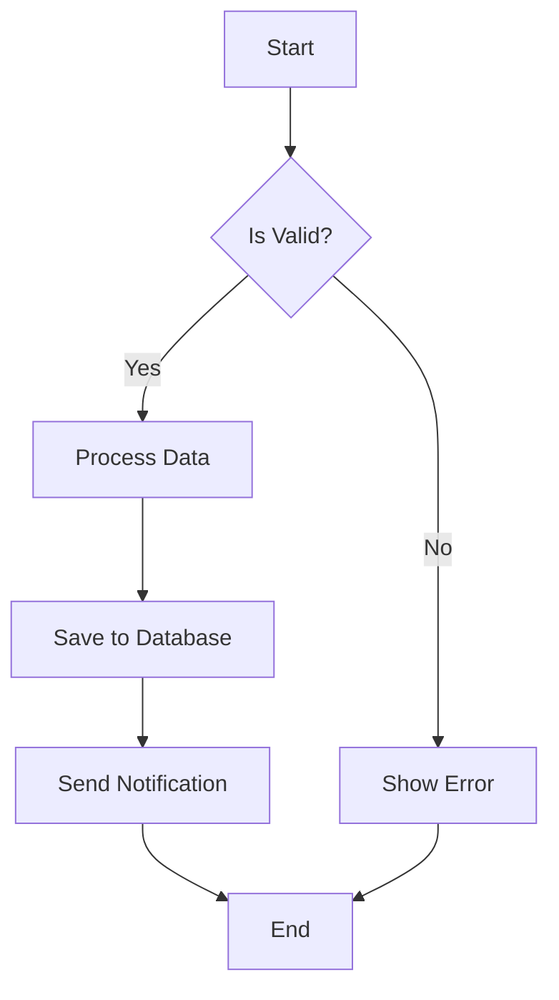

#### Node Shapes

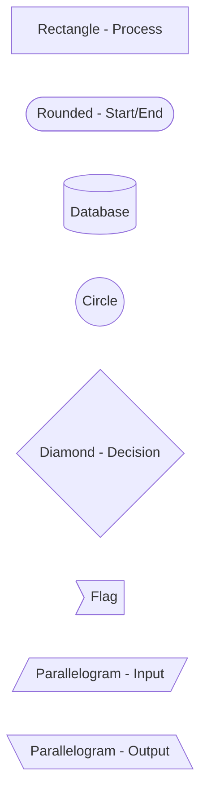

#### Direction Options

- `TD` or `TB`: Top to bottom
- `BT`: Bottom to top
- `LR`: Left to right
- `RL`: Right to left

#### Best Practices

- Keep flowcharts simple (max 10-15 nodes)
- Use consistent node shapes for similar concepts
- Label decision branches clearly (Yes/No, True/False)
- Align nodes visually when possible
- Use subgraphs for complex sections

#### Example: User Authentication Flow

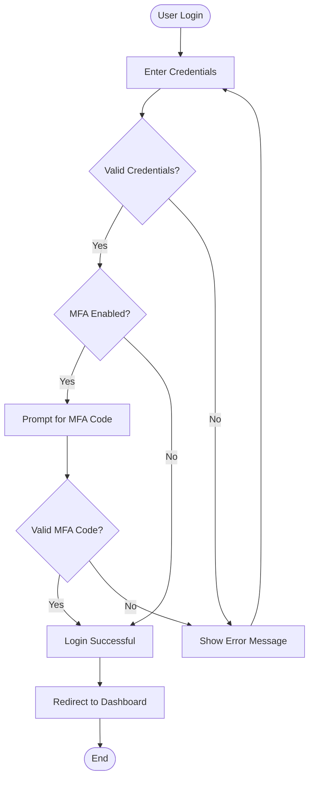

### 2. Sequence Diagrams

**Use for:** API interactions, request/response flows, inter-service communication

#### Basic Syntax

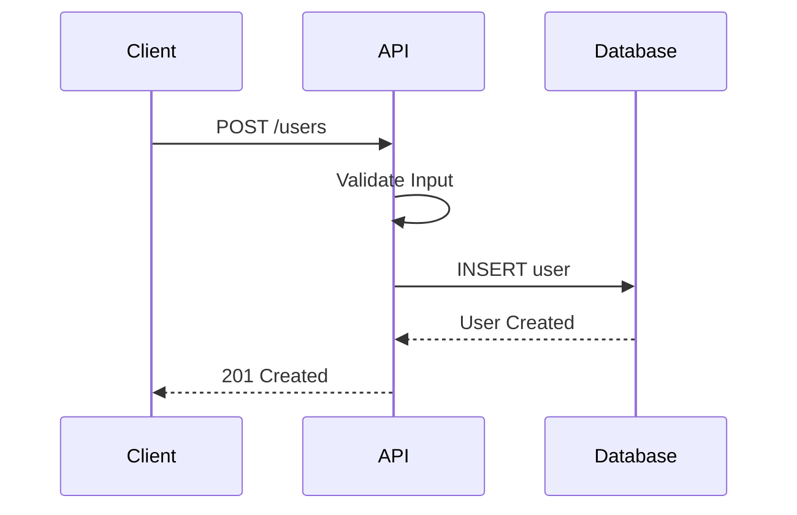

#### Features

- **Participants**: Define actors/systems
- **Messages**: Solid arrows for requests, dashed for responses
- **Activation**: Show when a participant is active
- **Notes**: Add explanatory text
- **Loops**: Show repeated actions
- **Alternatives**: Show conditional flows

#### Advanced Example

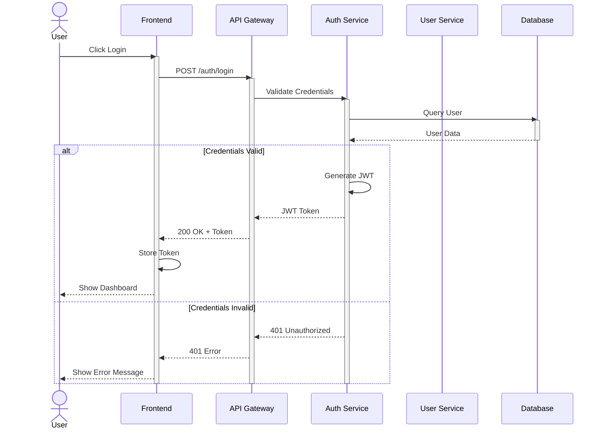

#### Best Practices

- List participants in order of interaction
- Use meaningful participant names
- Add notes for complex logic
- Show error paths with alt/opt
- Indicate async operations clearly

### 3. Class Diagrams

**Use for:** Object-oriented design, data models, entity relationships

#### Basic Syntax

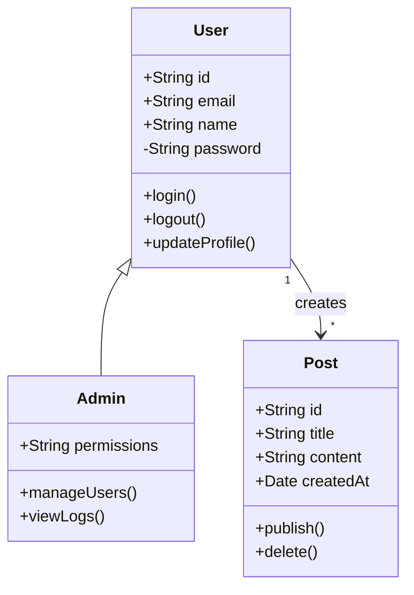

#### Visibility Modifiers

- `+` Public
- `-` Private
- `#` Protected
- `~` Package/Internal

#### Relationships

- `<|--` Inheritance
- `*--` Composition
- `o--` Aggregation
- `-->` Association
- `..>` Dependency
- `..|>` Realization

#### Example: E-commerce Domain Model

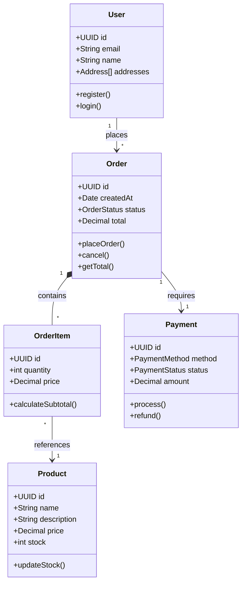

### 4. Entity Relationship Diagrams

**Use for:** Database schemas, data modeling

#### Basic Syntax

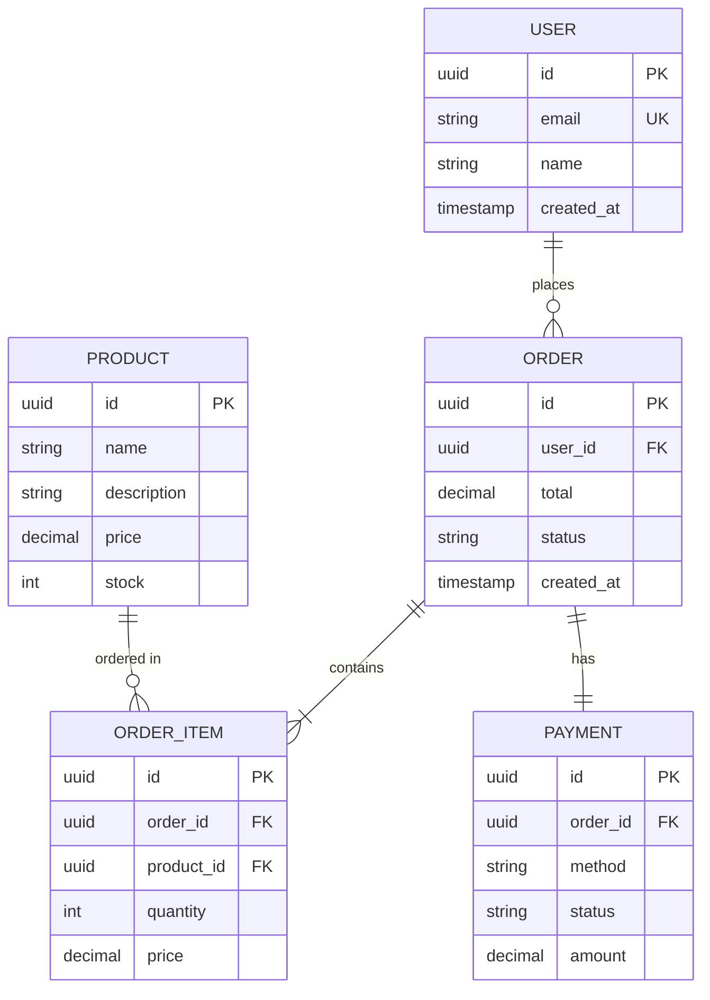

#### Relationship Types

- `||--||` One to one
- `||--o{` One to many
- `}o--o{` Many to many
- `||--o|` One to zero or one

#### Cardinality

- `|o` Zero or one
- `||` Exactly one
- `}o` Zero or more
- `}|` One or more

### 5. State Diagrams

**Use for:** Application states, state machines, workflow states

#### Basic Syntax

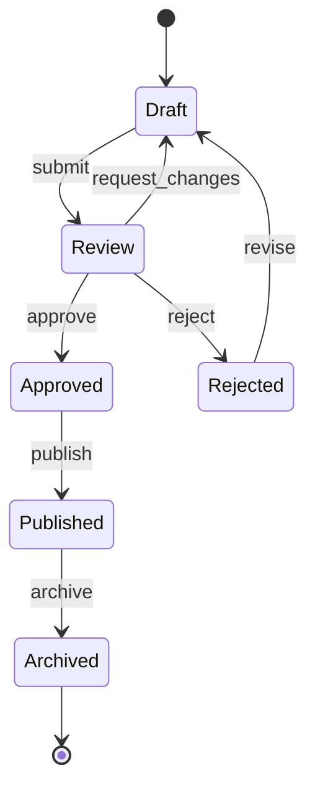

#### Example: Order Status Flow

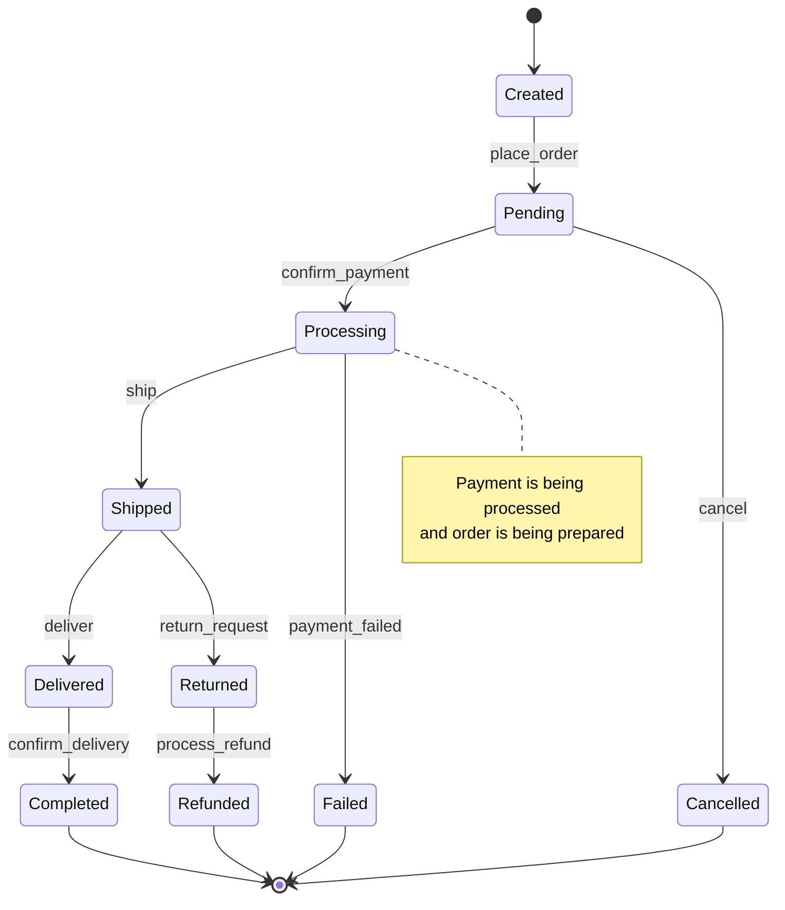

### 6. Gantt Charts

**Use for:** Project timelines, sprints, task scheduling

#### Basic Syntax

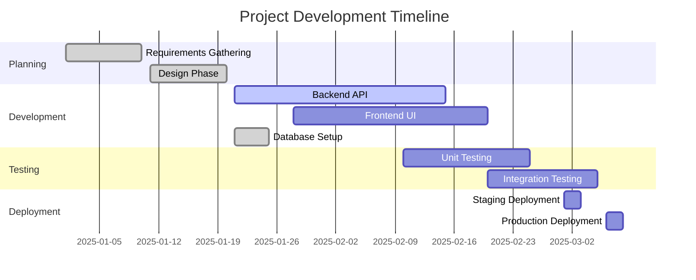

### 7. Pie Charts

**Use for:** Proportions, distributions, percentages

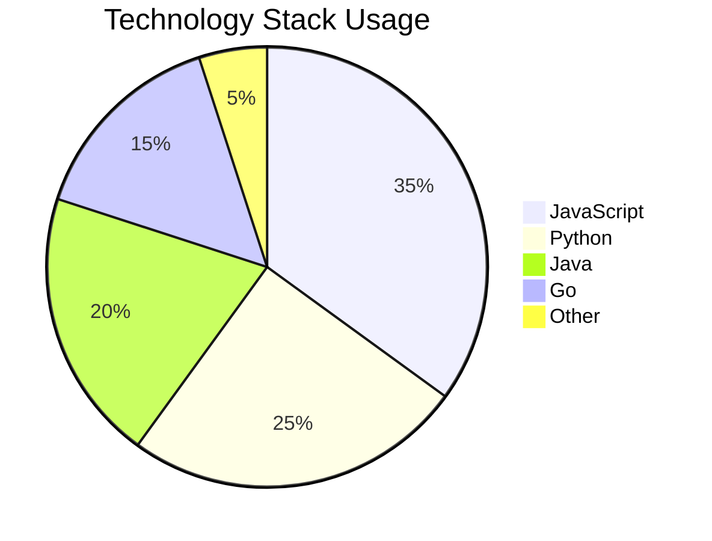

### 8. Git Graph

**Use for:** Branch strategies, git workflows

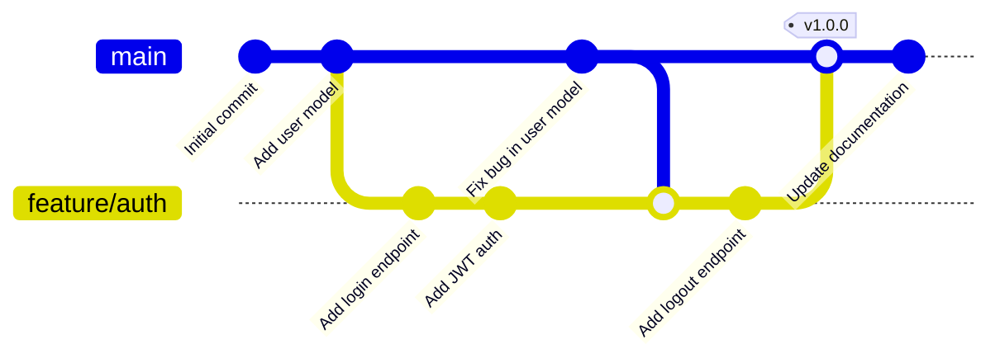

### 9. C4 Diagrams

**Use for:** System architecture, component relationships

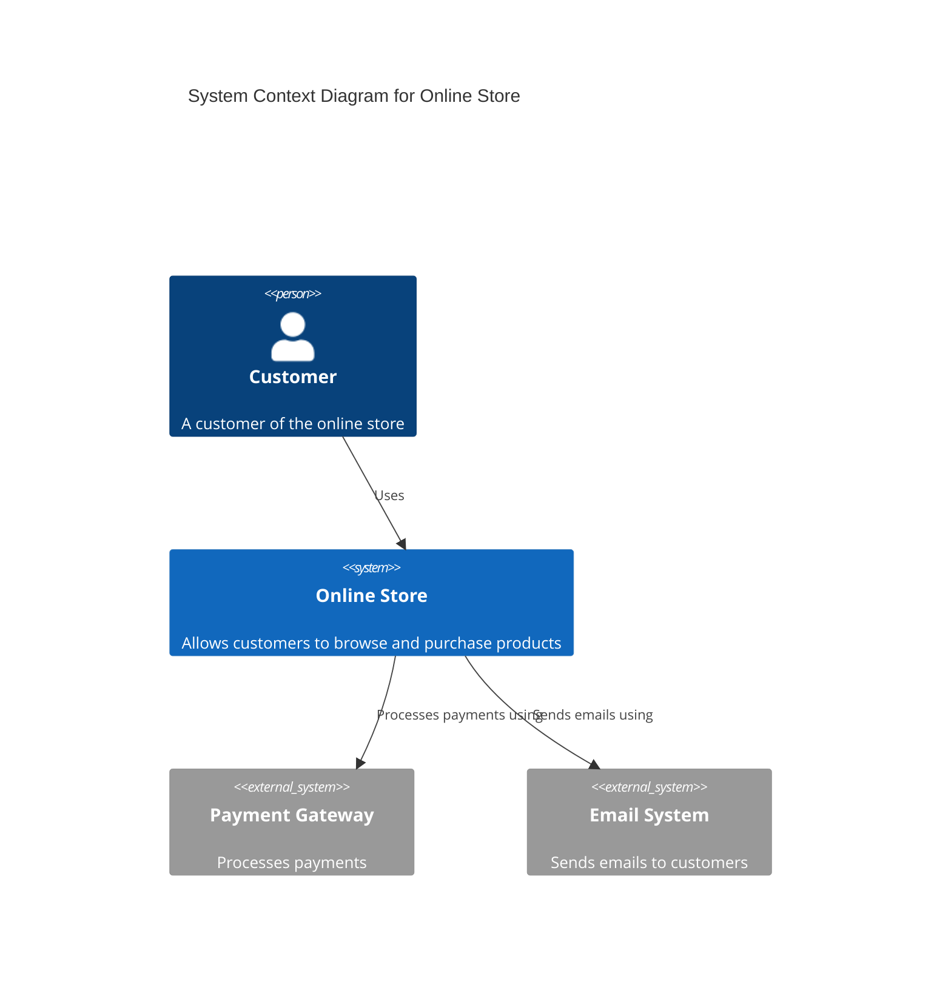

## Styling Conventions

### Colors

Use consistent colors for different types of nodes:

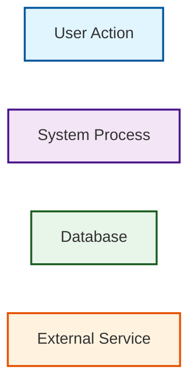

### Consistent Naming

- Use **PascalCase** for classes and entities
- Use **camelCase** for methods and attributes
- Use **UPPER_CASE** for constants and table names
- Use descriptive names, avoid abbreviations

## Best Practices

### 1. Keep Diagrams Focused

- One concept per diagram
- Maximum 10-15 elements
- Break complex diagrams into multiple views

### 2. Use Consistent Layout

- Top-to-bottom for hierarchical flows
- Left-to-right for sequential processes
- Group related elements

### 3. Label Everything

- Clear node labels
- Descriptive edge labels
- Add notes for complex logic

### 4. Maintain Diagrams

- Update diagrams with code changes
- Version control diagrams with code
- Add diagram update date

### 5. Choose the Right Diagram Type

| Diagram Type | Best For |
|--------------|----------|
| Flowchart | Algorithms, processes, decision flows |
| Sequence | API calls, message flows, interactions |
| Class | Object models, inheritance, relationships |
| ER | Database schemas, data models |
| State | State machines, workflows, status flows |
| Gantt | Timelines, schedules, project plans |
| Pie | Proportions, distributions |

## Common Patterns

### Pattern 1: Microservices Architecture

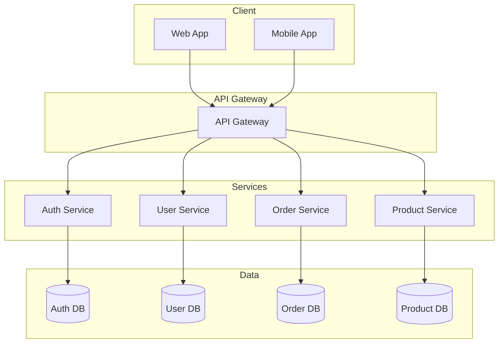

### Pattern 2: Request/Response Flow

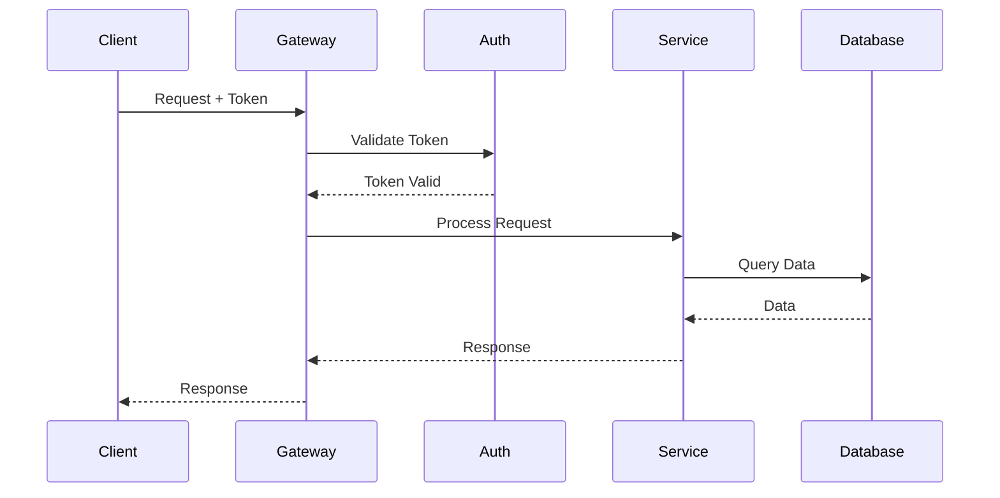

### Pattern 3: Event-Driven Architecture

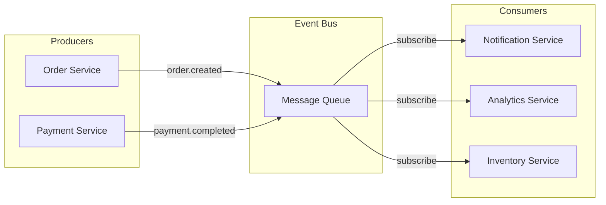

## Testing Diagrams

### Online Tools

- [Mermaid Live Editor](https://mermaid.live/)
- [Mermaid Chart](https://www.mermaidchart.com/)

### Local Testing

Many markdown editors support Mermaid:
- VSCode (with extensions)
- Obsidian
- Typora
- GitHub/GitLab markdown

### Validation

Before committing diagrams:
1. Test syntax in Mermaid Live Editor
2. Verify rendering in target platform
3. Check for broken references
4. Validate against conventions

## Documentation

Always include:
- Diagram title/caption
- Brief description
- Legend if using custom styles
- Last update date

Example:
```markdown
### System Architecture

The following diagram shows the high-level architecture of the system.

```mermaid
[diagram code]
```

**Last Updated:** 2025-01-15
**Legend:**
- Blue: User-facing components
- Purple: Backend services
- Green: Data stores
```

## Accessibility

- Use descriptive labels
- Avoid color-only differentiation
- Provide text alternatives
- Ensure sufficient contrast

## Version Control

- Store diagrams as code (Mermaid syntax)
- Keep diagrams close to related code
- Update diagrams in same commit as code changes
- Include diagram changes in code reviews