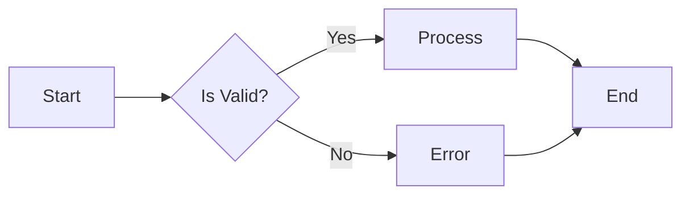

# Documentation Standards

This document outlines the standards and best practices for writing technical documentation in this project.

## Writing Style Guidelines

### General Principles

1. **Clarity Over Cleverness**
   - Use simple, direct language
   - Avoid jargon unless necessary
   - Define technical terms on first use
   - Write for your audience's knowledge level

2. **Consistency**
   - Use consistent terminology throughout
   - Follow the same structure for similar content
   - Maintain consistent voice and tone
   - Use uniform formatting and styling

3. **Conciseness**
   - Get to the point quickly
   - Remove unnecessary words
   - Use bullet points for lists
   - Break long paragraphs into smaller ones

4. **Active Voice**
   - Prefer: "The API returns a JSON object"
   - Avoid: "A JSON object is returned by the API"
   - Exception: When the actor is unknown or unimportant

### Tone and Voice

- **Professional yet approachable**: Friendly but not casual
- **Instructional**: Guide readers through tasks step-by-step
- **Confident**: Avoid hedging language like "maybe" or "possibly"
- **Inclusive**: Use "you" and "we", avoid gendered pronouns

## Formatting Conventions

### Headings

- Use sentence case for headings
- Maximum 3 levels deep (H1, H2, H3)
- Keep headings concise (under 60 characters)
- Use descriptive, not clever, headings

```markdown
# Main Title (H1)
## Section Title (H2)
### Subsection Title (H3)
```

### Code Blocks

Always specify the language for syntax highlighting:

```markdown
```javascript
const greeting = "Hello, World!";
console.log(greeting);
```
```

Use inline code for:
- Variable names: `userName`
- Function names: `getUserById()`
- File paths: `/etc/config.yaml`
- Command names: `npm install`

### Lists

**Unordered Lists:**
- Use for items without specific order
- Start with a verb when describing actions
- Keep items parallel in structure

**Ordered Lists:**
1. Use for sequential steps
2. Keep each step actionable
3. Include expected outcomes

**Nested Lists:**
- Parent item
  - Child item
  - Another child item
    - Grandchild item

### Links

- Use descriptive link text (not "click here")
- Prefer relative links for internal documents
- Check links regularly for validity

```markdown
Good: See the [API documentation](./api-reference.md) for details.
Bad: Click [here](./api-reference.md) for more information.
```

### Tables

- Use tables for structured data
- Keep tables simple (max 5 columns)
- Include header row
- Align columns appropriately

```markdown
| Parameter | Type   | Required | Description       |
|-----------|--------|----------|-------------------|
| id        | string | Yes      | User identifier   |
| name      | string | No       | User display name |
```

### Images and Diagrams

- Always include alt text
- Keep images close to related content
- Use diagrams for complex concepts
- Optimize image file sizes

```markdown

```

## Code Example Standards

### Complete and Runnable

- Provide complete, working examples
- Include necessary imports and setup
- Show expected output
- Test all code examples

### Example Structure

```markdown
### Example: Creating a User

```javascript
// Import required modules
const UserService = require('./services/UserService');

// Create a new user
const user = await UserService.create({
  name: "Jane Doe",
  email: "jane@example.com"
});

console.log(user);
// Output: { id: "123", name: "Jane Doe", email: "jane@example.com" }
```
```

### Error Handling

Show how to handle errors:

```javascript
try {
  const user = await UserService.create(userData);
  console.log("User created:", user);
} catch (error) {
  console.error("Failed to create user:", error.message);
}
```

### Comments in Code

- Explain the "why", not the "what"
- Keep comments up to date
- Use comments to highlight important concepts
- Remove commented-out code

## Diagram Best Practices

### When to Use Diagrams

- Complex system architectures
- Data flow and processing pipelines
- API interaction sequences
- Database schemas
- Decision trees and workflows

### Diagram Types

1. **Flowcharts**: Process flows, algorithms
2. **Sequence Diagrams**: API interactions, request/response flows
3. **Class Diagrams**: Object models, inheritance
4. **ER Diagrams**: Database relationships
5. **Component Diagrams**: System architecture
6. **State Diagrams**: Application states, state transitions

### Mermaid Syntax

Keep diagrams simple and readable:



### Diagram Guidelines

- Use clear, descriptive labels
- Limit complexity (max 10-15 nodes)
- Use consistent styling
- Include a caption explaining the diagram
- Keep diagrams up to date with code

## Documentation Structure

### README.md Structure

Every project/module should have a README with:

1. **Title and Description**: What is this project?
2. **Installation**: How to set it up
3. **Usage**: Basic examples
4. **API Reference**: Main functions/classes
5. **Configuration**: Environment variables, config files
6. **Contributing**: How to contribute
7. **License**: License information

### API Documentation Structure

For each API endpoint:

1. **Endpoint**: HTTP method and path
2. **Description**: What it does
3. **Parameters**: Query, path, body parameters
4. **Request Example**: Sample request
5. **Response Example**: Sample response
6. **Error Codes**: Possible errors
7. **Authentication**: Auth requirements

### Architecture Documentation Structure

1. **Overview**: High-level system description
2. **Architecture Diagram**: Visual representation
3. **Components**: Major system components
4. **Data Flow**: How data moves through the system
5. **Technology Stack**: Languages, frameworks, tools
6. **Design Decisions**: Why certain choices were made
7. **Trade-offs**: Known limitations

## Version Control

### Documentation Versioning

- Version documentation with code
- Tag documentation releases
- Maintain changelog
- Archive old versions

### Changelog Format

```markdown
## [1.2.0] - 2025-01-15

### Added
- New authentication endpoints
- User profile management API

### Changed
- Updated error response format
- Improved rate limiting

### Deprecated
- `/api/v1/users/list` (use `/api/v2/users` instead)

### Removed
- Legacy XML response format

### Fixed
- Fixed pagination bug in user search
```

## Review Checklist

Before publishing documentation:

- [ ] Spelling and grammar checked
- [ ] Code examples tested and working
- [ ] Links verified and working
- [ ] Diagrams up to date
- [ ] Formatting consistent
- [ ] Terminology consistent
- [ ] Screenshots current
- [ ] Version numbers correct
- [ ] Table of contents updated
- [ ] Cross-references correct

## Common Mistakes to Avoid

1. **Outdated documentation**: Update docs with code changes
2. **Missing examples**: Always provide usage examples
3. **Broken links**: Validate links regularly
4. **Unclear instructions**: Test with someone unfamiliar with the code
5. **Missing error handling**: Show how to handle failures
6. **Inconsistent terminology**: Use the same terms throughout
7. **Too much detail**: Focus on what users need to know
8. **No context**: Explain the "why" behind features

## Tools and Resources

### Documentation Tools

- **Markdown editors**: VSCode, Typora, Obsidian
- **Diagram tools**: Mermaid, PlantUML, Draw.io
- **API documentation**: Swagger UI, Redoc, Postman
- **Link checkers**: markdown-link-check
- **Spell checkers**: Vale, CSpell

### Style Guides

- [Google Developer Documentation Style Guide](https://developers.google.com/style)
- [Microsoft Writing Style Guide](https://learn.microsoft.com/en-us/style-guide/welcome/)
- [Write the Docs](https://www.writethedocs.org/guide/writing/style-guides/)

## Language-Specific Guidelines

### JavaScript/TypeScript

```javascript
/**
 * Creates a new user in the database.
 *
 * @param {Object} userData - The user data
 * @param {string} userData.name - User's full name
 * @param {string} userData.email - User's email address
 * @returns {Promise<User>} The created user object
 * @throws {ValidationError} If user data is invalid
 * @example
 * const user = await createUser({
 *   name: "Jane Doe",
 *   email: "jane@example.com"
 * });
 */
async function createUser(userData) {
  // Implementation
}
```

### Python

```python
def create_user(name: str, email: str) -> User:
    """
    Create a new user in the database.

    Args:
        name (str): User's full name
        email (str): User's email address

    Returns:
        User: The created user object

    Raises:
        ValidationError: If user data is invalid

    Example:
        >>> user = create_user("Jane Doe", "jane@example.com")
        >>> print(user.name)
        Jane Doe
    """
    # Implementation
```

### Java

```java
/**
 * Creates a new user in the database.
 *
 * @param name the user's full name
 * @param email the user's email address
 * @return the created User object
 * @throws ValidationException if user data is invalid
 * @since 1.0.0
 * @see User
 */
public User createUser(String name, String email) {
    // Implementation
}
```

## Accessibility

- Use semantic HTML in generated docs
- Provide alt text for images
- Ensure good color contrast
- Support keyboard navigation
- Use ARIA labels where appropriate
- Test with screen readers

## Internationalization

- Write in clear, simple English
- Avoid idioms and cultural references
- Use standard date/time formats (ISO 8601)
- Consider translation requirements
- Separate content from code where possible

## Conclusion

Good documentation:
- Saves time for users and maintainers
- Reduces support burden
- Improves code quality
- Facilitates collaboration
- Increases adoption

Remember: Documentation is code. Treat it with the same care and attention as your production code.